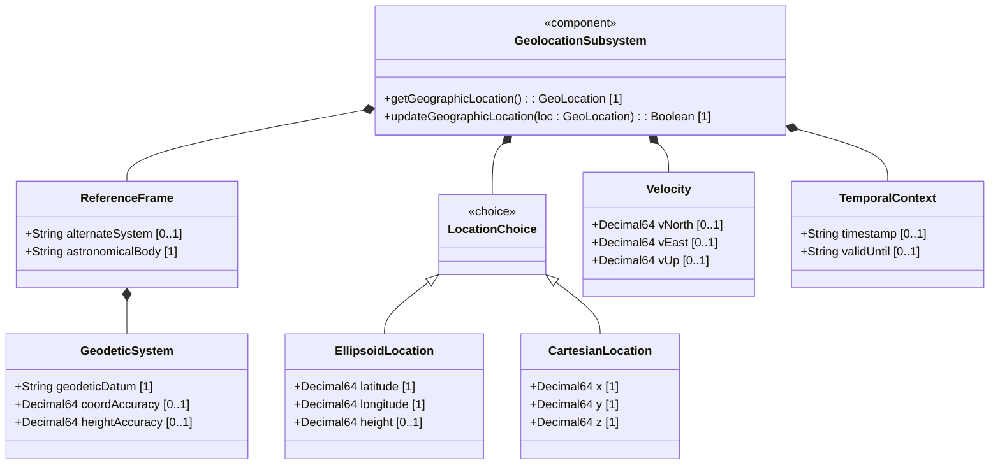
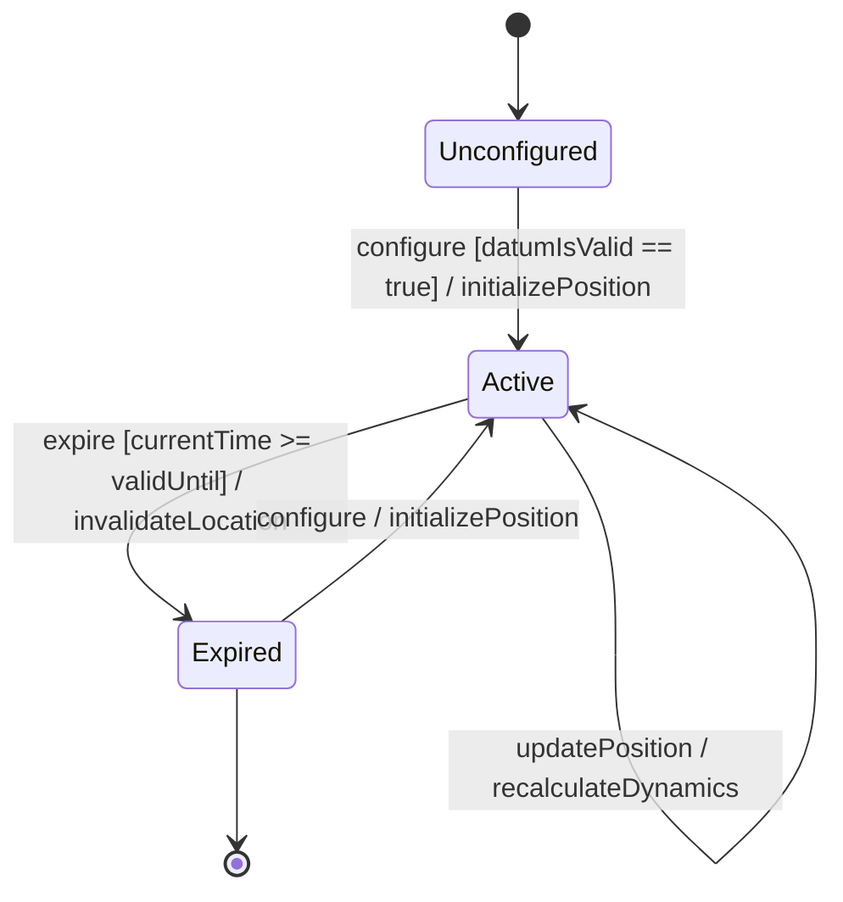

# Epic: Geographic Location Representation

## 1. Context
The `ietf-geo-location` module defines a grouping for a geographic location container suitable for referencing positions on or around astronomical objects (e.g., Earth). The specification supports configure-once reference systems and datum definitions, choosing between ellipsoidal and Cartesian coordinates, modeling 3D velocity vectors for moving objects, and establishing temporal validity constraints (timestamps and expiration times) to manage geolocation validity decay.

### Specification Context
"This module defines a grouping of a container object for specifying a location on or around an astronomical object (e.g., 'earth')."

## 2. Requirements & Checklist
- [x] #1 - [Reference Frame Configuration](https://github.com/gintatkinson/dep-tst37/blob/main/docs/features/feat-01-reference-frame.md) (Defines coordinates system, datum, body and accuracies)
- [x] #2 - [Geographic Position Resolution](https://github.com/gintatkinson/dep-tst37/blob/main/docs/features/feat-02-geographic-position.md) (Enables choosing between ellipsoidal and Cartesian coordinate types)
- [x] #3 - [Geolocation Dynamics and Temporal Context](https://github.com/gintatkinson/dep-tst37/blob/main/docs/features/feat-03-dynamics-temporal.md) (Models 3D velocity vectors and timestamps)

### Associated Use Cases & User Stories

#### Associated Use Cases
- [x] #10 - [Configure Frame of Reference and Position](https://github.com/gintatkinson/dep-tst37/blob/main/docs/use-cases/uc-01-configure-position.md) (Standard spatial configuration use case)
- [x] #11 - [Monitor Dynamic Geolocation and Expiration](https://github.com/gintatkinson/dep-tst37/blob/main/docs/use-cases/uc-02-monitor-dynamics.md) (Active tracking and validity use case)

#### Associated User Stories
- [x] #5 - [Ellipsoidal Positioning on Earth](https://github.com/gintatkinson/dep-tst37/blob/main/docs/user-stories/us-01-ellipsoidal-positioning.md) (Standard positioning scenario)
- [x] #6 - [Cartesian Coordinate Positioning](https://github.com/gintatkinson/dep-tst37/blob/main/docs/user-stories/us-02-cartesian-positioning.md) (Alternative spatial representation)
- [x] #7 - [Alternate Reference System Simulation](https://github.com/gintatkinson/dep-tst37/blob/main/docs/user-stories/us-03-alternate-reference-system.md) (Virtual realities / alternate bodies)
- [x] #8 - [Velocity Vector to Speed and Heading Calculation](https://github.com/gintatkinson/dep-tst37/blob/main/docs/user-stories/us-04-velocity-calculations.md) (Algorithmic speed/heading calculations)
- [x] #9 - [Geolocation Temporal Expiration](https://github.com/gintatkinson/dep-tst37/blob/main/docs/user-stories/us-05-temporal-expiration.md) (Validity decay handling)
## 3. Architecture and System Interaction Diagrams

### Subsystem Component Definition
The `GeolocationSubsystem` component exposes standard programmatic interfaces for querying and updating geographic location configurations:
- `getGeographicLocation() : GeoLocation [1]`
- `updateGeographicLocation(loc : GeoLocation) : Boolean [1]`

## System-Level UML Class Diagram

## System State Machine Diagram

## 4. Operational Considerations
Operational deployment of the Geolocation subsystem requires careful monitoring of coordinate update frequencies and spatial resolution limits. High-frequency velocity and telemetry streams must be throttled to prevent resource exhaustion. Validity checks on `valid-until` timestamps must be executed periodically to ensure dynamic locations are pruned or refreshed.

## 5. Security & Governance
Access control to location configurations must be governed strictly using standard NETCONF Access Control Model (NACM). Modifications to the reference frame or coordinates require high privilege levels. Ingestion filters must validate and sanitize all coordinate ranges (e.g. latitude within `[-90..90]`, longitude within `[-180..180]`) and format pattern constraints to prevent injection or corruption of the spatial database.

## 6. Source References
Structural Schema: schema/ietf-geo-location@2022-02-11.yang
Normative Specification: https://datatracker.ietf.org/doc/rfc9179/
