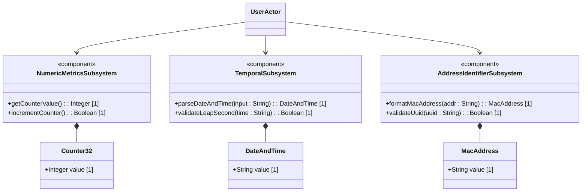
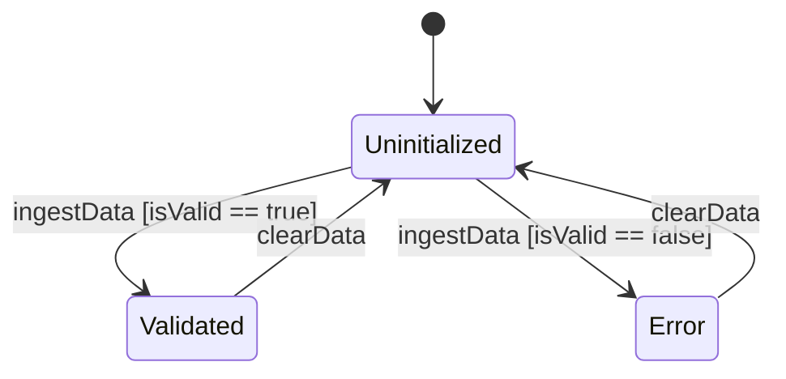

# Epic: Common YANG Data Types

## 1. Context
This Epic covers the collection of generally useful derived YANG data types defined in RFC 9911 (e.g., counters, gauges, object identifiers, dates, times, timestamps, physical addresses, and uuid).

### Specification Context
"This module contains a collection of generally useful derived YANG data types." (from RFC 9911)

## 2. Requirements & Checklist
- [ ] #12 - [Numeric and Identifier Metrics](https://github.com/gintatkinson/dep-tst37/blob/base-rfc9179-rfc9911/docs/features/feat-04-numeric-metrics.md) (Defines counters, gauges, and timeticks)
- [ ] #13 - [Date, Time, and Temporal Precision](https://github.com/gintatkinson/dep-tst37/blob/base-rfc9179-rfc9911/docs/features/feat-05-temporal-precision.md) (Defines high precision times and durations)
- [ ] #14 - [Physical Addresses and Structural Identifiers](https://github.com/gintatkinson/dep-tst37/blob/base-rfc9179-rfc9911/docs/features/feat-06-physical-structural.md) (Defines MAC addresses, physical addresses, and UUIDs)

### Associated Use Cases & User Stories

#### Associated Use Cases
- [ ] #19 - [Ingest and Validate Metrics](https://github.com/gintatkinson/dep-tst37/blob/base-rfc9179-rfc9911/docs/use-cases/uc-03-ingest-validate-metrics.md) (Standard validation use case)
- [ ] #20 - [Timestamp Synchronization](https://github.com/gintatkinson/dep-tst37/blob/base-rfc9179-rfc9911/docs/use-cases/uc-04-timestamp-synchronization.md) (Active time tracking synchronization use case)

#### Associated User Stories
- [ ] #16 - [Counter and Gauge Operations](https://github.com/gintatkinson/dep-tst37/blob/base-rfc9179-rfc9911/docs/user-stories/us-06-counter-gauge-ops.md) (Verifies counter and gauge logic)
- [ ] #17 - [Precision Temporal Tracking](https://github.com/gintatkinson/dep-tst37/blob/base-rfc9179-rfc9911/docs/user-stories/us-07-precision-temporal-tracking.md) (Verifies high-precision timestamp handling)
- [ ] #18 - [Address Parsing](https://github.com/gintatkinson/dep-tst37/blob/base-rfc9179-rfc9911/docs/user-stories/us-08-address-parsing.md) (Verifies MAC address and UUID validation)
## 3. Architecture

### Subsystem Component Definition
The `YangTypesSubsystem` coordinates data type parsing, range checking, and standard representation formatting for metrics, timestamps, and address identifiers.

## System-Level UML Class Diagram

## System State Machine Diagram

## 4. Operational Considerations
High frequency metric polls and log timestamps require efficient string representation formatting to prevent high CPU utilization and memory fragmentation. Numeric counters must handle rollover logic seamlessly to avoid management system tracking discontinuity.

## 5. Security & Governance
Ingested values must conform strictly to RFC 9911 patterns and ranges to prevent buffer overflow and input injection attacks. Privileged access via standard Netconf Access Control Model (NACM) must be enforced for configuration metrics.

## 6. Source References
Structural Schema: schema/ietf-yang-types@2025-12-22.yang
Normative Specification: https://datatracker.ietf.org/doc/base-rfc9179-rfc9911/
