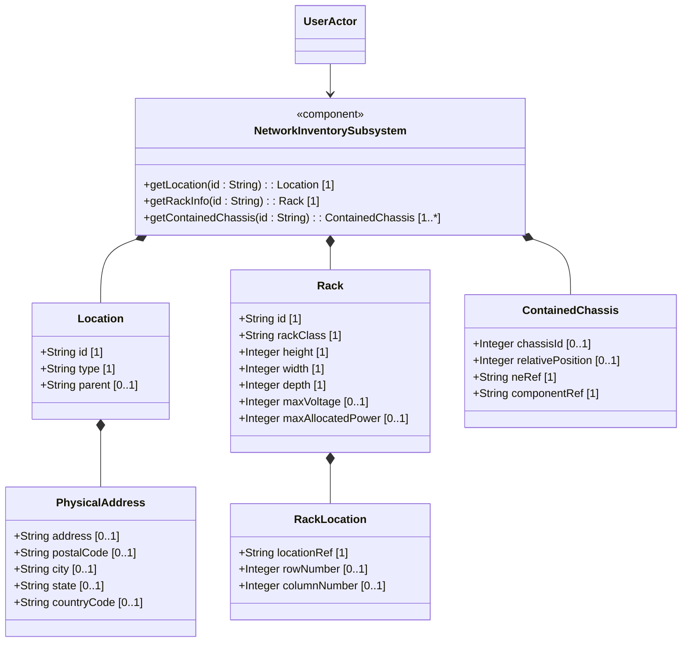
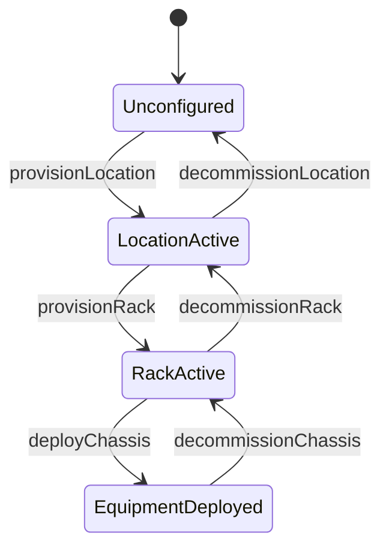

# Epic: Network Inventory Location Representation

## 1. Context
This Epic covers the representation of physical locations, equipment rooms, racks, electrical ratings, row/column layout alignments, and active equipment chassis containment in the network inventory data model.

### Specification Context
"This YANG module defines a model for Network Inventory location." (from ietf-ni-location.yang)

## 2. Requirements & Checklist
- [ ] #21 - [Physical and Geographic Location Attributes](https://github.com/gintatkinson/dep-tst37/blob/ietf-ni-location/docs/features/feat-07-physical-geographic-location.md) (Defines coordinates, postal addresses, and location hierarchies)
- [ ] #22 - [Rack Structural Infrastructure](https://github.com/gintatkinson/dep-tst37/blob/ietf-ni-location/docs/features/feat-08-rack-infrastructure.md) (Defines rack layouts, dimensions, and electrical limits)
- [ ] #23 - [Distributed Chassis Layout and Containment](https://github.com/gintatkinson/dep-tst37/blob/ietf-ni-location/docs/features/feat-09-distributed-chassis-containment.md) (Defines containment of chassis within locations and U-slots of racks)

### Associated Use Cases & User Stories

#### Associated Use Cases
- [ ] #28 - [Provision Location Infrastructure](https://github.com/gintatkinson/dep-tst37/blob/ietf-ni-location/docs/use-cases/uc-05-provision-location-infrastructure.md) (Standard infrastructure setup use case)
- [ ] #29 - [Deploy Rack Equipment](https://github.com/gintatkinson/dep-tst37/blob/ietf-ni-location/docs/use-cases/uc-06-deploy-rack-equipment.md) (Active racking and deployment use case)

#### Associated User Stories
- [ ] #25 - [Physical Address Validation and Location Hierarchy](https://github.com/gintatkinson/dep-tst37/blob/ietf-ni-location/docs/user-stories/us-09-physical-address-hierarchy.md) (Verifies country-code and parent validation)
- [ ] #26 - [Rack Space Allocation and Electrical Limits](https://github.com/gintatkinson/dep-tst37/blob/ietf-ni-location/docs/user-stories/us-10-rack-space-allocation.md) (Verifies dimension boundaries and maximum power ratings)
- [ ] #27 - [Equipment Containment and Relative Positioning](https://github.com/gintatkinson/dep-tst37/blob/ietf-ni-location/docs/user-stories/us-11-equipment-chassis-containment.md) (Verifies U-slot position and component leafref checking)
## 3. Architecture

### Subsystem Component Definition
The `NetworkInventorySubsystem` component coordinates location hierarchy mappings, rack physical assignments, power limits, and relative slot containment referencing for network elements and components.

## System-Level UML Class Diagram

## System State Machine Diagram

## 4. Operational Considerations
Physical dimensions (height, width, depth) must be monitored dynamically to ensure rack placement limits do not exceed actual floor space. Power and voltage allocations must be validated before equipment installation to prevent localized circuit breaker trips and thermal overloading in the equipment room.

## 5. Security & Governance
Access to inventory locations and physical security classifications (e.g. rack-class identity standards) must be protected using standard NETCONF NACM controls. Country codes must be strictly validated against standard ISO ALPHA-2 codes during location onboarding.

## 6. Source References
Structural Schema: schema/ietf-ni-location.yang
Normative Specification: https://datatracker.ietf.org/doc/html/draft-ietf-ivy-network-inventory-location
