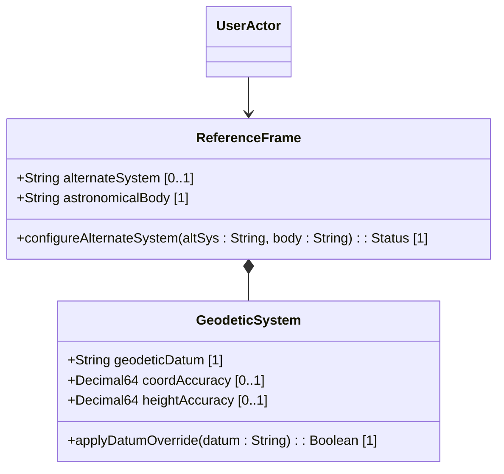

# Feature: Reference Frame Configuration

## Description
This feature specifies the configuration of the geographical frame of reference, including the target astronomical body (e.g. Earth, Moon), the geodetic datum system (e.g. WGS-84), and precision/accuracy limits.

## UML Class Diagram


## Interface Requirements
### 1. Test Data Shape / Payload Schema (JSON Example)
```json
{
  "reference-frame": {
    "alternate-system": "virtual-mars-simulation",
    "astronomical-body": "mars",
    "geodetic-system": {
      "geodetic-datum": "mola-2000",
      "coord-accuracy": 0.000100,
      "height-accuracy": 0.100000
    }
  }
}
```

### 2. Validation & Constraints
- `astronomical-body`: Mandatory field. Defaults to "earth". Must conform to the pattern `[ -@\[-\^_-~]*` (ASCII characters 32..126 excluding uppercase letters in canonical form).
- `geodetic-datum`: Mandatory field when coordinates are provided. Must conform to pattern `[ -@\[-\^_-~]*`. Spaces are replaced with dashes (e.g. "wgs-84").
- `coord-accuracy`: Optional. Must be a decimal64 with exactly 6 fraction digits.
- `height-accuracy`: Optional. Must be a decimal64 with exactly 6 fraction digits, with units: "meters".

### 3. Visual Layout & Arrangement / Logical Operations & Interface Messages
- **For UI**: The configuration parameters must be presented in a compact `PropertyGrid` form. Layout containment must isolate reflows during panel resize. Outlined inputs are limited to 12px font size.
- **For API/M2M**: Exposes GET/PUT operations on `/geo-location/reference-frame` to query and configure reference frame fields.

### 4. Interactive Flow & States / Logical Exception States & Validation Failures
- If the configured `geodetic-datum` format does not match the allowed pattern, the system must return a 400 Bad-Request with error type `constraint-violation` and error-path `/reference-frame/geodetic-system/geodetic-datum`.
- If the `coord-accuracy` fraction digits exceed 6, reject with constraint violation.

## Given-When-Then Acceptance Criteria
- **Scenario 1: Configure default reference frame**
  Given a default reference frame initialization request
  When no astronomical body is specified
  Then the system sets the astronomical-body to "earth" and geodetic-datum to "wgs-84"

- **Scenario 2: Reject invalid geodetic datum pattern**
  Given a Netconf Client session
  When client attempts to set geodetic-datum to a value containing illegal characters (like control characters)
  Then the system rejects the request with a validation exception

## Specification Context (Verbatim)
"The frame of reference ('reference-frame') defines what the location values refer to and their meaning. The referred-to object can be any astronomical body. The default 'astronomical-body' value is 'earth'."

## 4. Source References
Structural Schema: [ietf-geo-location@2022-02-11.yang](file:///Users/perkunas/jail/dep-tst37/schema/ietf-geo-location@2022-02-11.yang)
Normative Specification: [RFC 9179](https://datatracker.ietf.org/doc/rfc9179/)

## 5. Logical UI & Layout Bindings
- **Target LUI Component:** PropertyGrid
- **Target Layout Container ID:** reference_frame_pane
- **Data Source Bindings:** schema:generic-status/status[target='active_focused_element']
