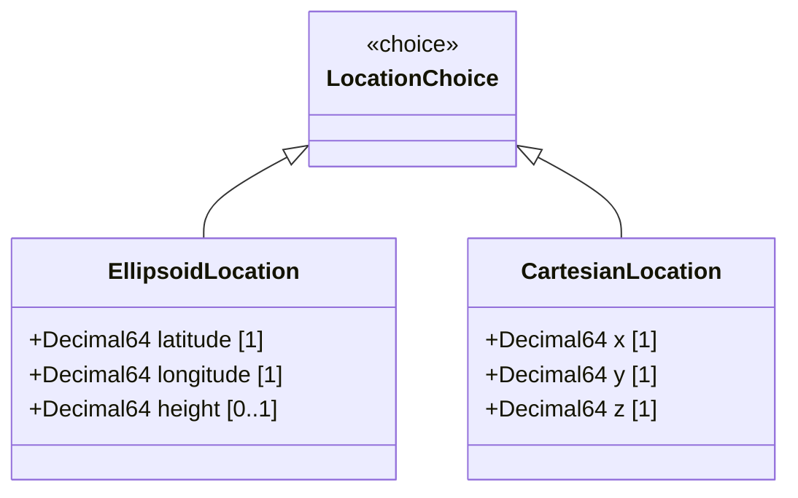

# Feature: Geographic Position Resolution

## Description
This feature enables coordinate choice resolution between standard ellipsoidal representations (latitude, longitude, height) and Cartesian spatial representations (x, y, z).

## UML Class Diagram


## Interface Requirements
### 1. Test Data Shape / Payload Schema (JSON Example)
```json
{
  "location": {
    "ellipsoid": {
      "latitude": 37.774929,
      "longitude": -122.419416,
      "height": 10.5
    }
  }
}
```

### 2. Validation & Constraints
- `choice location`: Mutually exclusive. A valid geographic position MUST contain either the `ellipsoid` case or the `cartesian` case, but never both.
- `latitude`: Valid range is -90.0000000000000000 to +90.0000000000000000 decimal degrees. Must be decimal64 with exactly 16 fraction digits.
- `longitude`: Valid range is -180.0000000000000000 to +180.0000000000000000 decimal degrees. Must be decimal64 with exactly 16 fraction digits.
- `height`: Optional. Must be decimal64 with exactly 6 fraction digits.
- `x`, `y`, `z`: Cartesian components. Must be decimal64 with exactly 6 fraction digits.

### 3. Visual Layout / Logical Operations & Interface Messages
- **For UI**: Renders position on a high-density `TopologyMap` layout. State updates must not cause DOM unmounting.
- **For API/M2M**: Exposes GET/PUT operations on `/geo-location/location` to read and write location coordinates.

### 4. Interactive Flow & States / Logical Exception States & Validation Failures
- If both `ellipsoid` and `cartesian` cases are provided, reject with code 400 and type `choice-exclusive-violation`.
- If `latitude` exceeds the range of [-90..90], reject with error path `/location/ellipsoid/latitude`.

## Given-When-Then Acceptance Criteria
- **Scenario 1: Set valid ellipsoidal location**
  Given a Netconf Client session
  When client sets latitude to 37.774929 and longitude to -122.419416
  Then the system registers the ellipsoidal position and returns success

- **Scenario 2: Reject out of bounds latitude**
  Given an ellipsoidal configuration request
  When latitude is set to 95.0000000000000000
  Then the system rejects the coordinates with a range violation error

## Specification Context (Verbatim)
"This is the location on, or relative to, the astronomical object. It is specified using two or three coordinate values. These values are given either as 'latitude', 'longitude', and an optional 'height', or as Cartesian coordinates of 'x', 'y', and 'z'."

## 4. Source References
Structural Schema: schema/ietf-geo-location@2022-02-11.yang
Normative Specification: https://datatracker.ietf.org/doc/rfc9179/

## 5. Logical UI & Layout Bindings
- **Target LUI Component**: TopologyMap
- **Target Layout Container ID**: topology_pane
- **Data Source Bindings**: schema:generic-topology/topology[@id='selected_entity']
