# Feature: Date, Time, and Temporal Precision

## Description
This feature specifies dates, times, durations, and high-precision timestamps defined in RFC 9911.

## UML Class Diagram

```mermaid
classDiagram
    class UserActor {
    }
    class TemporalSubsystem {
        <<component>>
        +parseDateAndTime(input : String) : DateAndTime [1]
        +validateLeapSecond(time : String) : Boolean [1]
    }
    class DateAndTime {
        +String value [1]
    }
    class Date {
        +String value [1]
    }
    class DateNoZone {
        +String value [1]
    }
    class Time {
        +String value [1]
    }
    class TimeNoZone {
        +String value [1]
    }
    class Timestamp {
        +String value [1]
    }
    class Hours32 {
        +Integer value [1]
    }
    class Minutes32 {
        +Integer value [1]
    }
    class Seconds32 {
        +Integer value [1]
    }
    class Centiseconds32 {
        +Integer value [1]
    }
    class Milliseconds32 {
        +Integer value [1]
    }
    class Microseconds32 {
        +Integer value [1]
    }
    class Microseconds64 {
        +Integer value [1]
    }
    class Nanoseconds32 {
        +Integer value [1]
    }
    class Nanoseconds64 {
        +Integer value [1]
    }

    UserActor --> TemporalSubsystem
    TemporalSubsystem *-- DateAndTime
    TemporalSubsystem *-- Date
    TemporalSubsystem *-- DateNoZone
    TemporalSubsystem *-- Time
    TemporalSubsystem *-- TimeNoZone
    TemporalSubsystem *-- Timestamp
    TemporalSubsystem *-- Hours32
    TemporalSubsystem *-- Minutes32
    TemporalSubsystem *-- Seconds32
    TemporalSubsystem *-- Centiseconds32
    TemporalSubsystem *-- Milliseconds32
    TemporalSubsystem *-- Microseconds32
    TemporalSubsystem *-- Microseconds64
    TemporalSubsystem *-- Nanoseconds32
    TemporalSubsystem *-- Nanoseconds64
```


## Interface Requirements
### 1. Test Data Shape / Payload Schema (JSON Example)
```json
{
  "temporal": {
    "date-and-time-val": "2026-06-21T18:00:00Z",
    "date-val": "2026-06-21",
    "nanoseconds-64-val": 1000000000
  }
}
```

### 2. Validation & Constraints
- `date-and-time`: ISO 8601 representation, supports leap seconds.
- `date`: Date string with or without timezone support.
- `nanoseconds64`: High precision 64-bit integer nanosecond duration.

### 3. Visual Layout & Arrangement / Logical Operations & Interface Messages
- **For UI**: Dynamic telemetry list displaying precise temporal events.
- **For API/M2M**: Exposes GET/PUT operations on `/metrics/temporal`.

### 4. Interactive Flow & States / Logical Exception States & Validation Failures
- If leap second occurs, handle the timestamp containing ':60' seconds correctly.
- If datetime zone parsing violates RFC 9557 format, reject with a validation constraint violation.

## Given-When-Then Acceptance Criteria
- **Scenario 1: Parse date and time with leap second**
  Given a datetime string "2026-12-31T23:59:60Z"
  When parseDateAndTime operation is called
  Then system successfully parses it and validates the leap second

## Source References
Structural Schema: schema/ietf-yang-types@2025-12-22.yang
Normative Specification: https://datatracker.ietf.org/doc/rfc9911/
