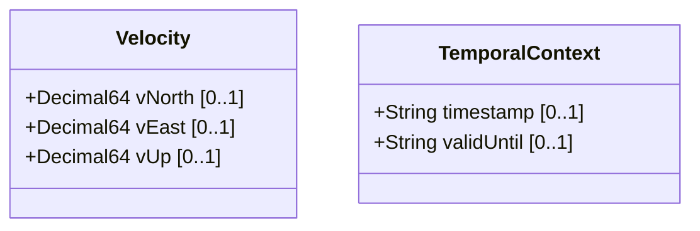

# Feature: Geolocation Dynamics and Temporal Context

## Description
This feature captures the motion dynamics of the geo-located object using 3D velocity vectors (v-north, v-east, v-up), recording the timestamp when the measurement was made and the validity expiration limit (valid-until).

## UML Class Diagram


## Interface Requirements
### 1. Test Data Shape / Payload Schema (JSON Example)
```json
{
  "velocity": {
    "v-north": 0.005,
    "v-east": -0.002,
    "v-up": 0.0
  },
  "timestamp": "2026-06-21T18:00:00Z",
  "valid-until": "2026-06-21T19:00:00Z"
}
```

### 2. Validation & Constraints
- `v-north`: Optional. Must be decimal64 with exactly 12 fraction digits.
- `v-east`: Optional. Must be decimal64 with exactly 12 fraction digits.
- `v-up`: Optional. Must be decimal64 with exactly 12 fraction digits.
- `timestamp`: Optional. Must conform to `yang:date-and-time` standard.
- `valid-until`: Optional. Must conform to `yang:date-and-time` standard. If specified, must be greater than or equal to `timestamp`.

### 3. Visual Layout / Logical Operations & Interface Messages
- **For UI**: Dynamic alerts and telemetry logs displayed in `DensityTable` using layout container `history_pane`.
- **For API/M2M**: Exposes GET on `/geo-location/velocity` and `/geo-location/timestamp` to read telemetry and validity bounds.

### 4. Interactive Flow & States / Logical Exception States & Validation Failures
- If `valid-until` represents a datetime prior to `timestamp`, reject the request with code 400 and type `invalid-temporal-range` on path `/valid-until`.

## Given-When-Then Acceptance Criteria
- **Scenario 1: Set dynamic velocity and valid timestamps**
  Given a moving entity
  When telemetry records v-north as 0.005 and valid-until as "2026-06-21T19:00:00Z" (after timestamp)
  Then the system updates velocity vectors and validates temporal limits

- **Scenario 2: Reject invalid temporal range**
  Given a telemetry update request
  When valid-until is configured as "2026-06-21T17:00:00Z" and timestamp is "2026-06-21T18:00:00Z"
  Then the system rejects the update with a range exception

## Specification Context (Verbatim)
"If the object is in motion, the velocity vector describes this motion at the time given by the timestamp. For a formula to convert these values to speed and heading, see RFC 9179."

## 4. Source References
Structural Schema: schema/ietf-geo-location@2022-02-11.yang
Normative Specification: https://datatracker.ietf.org/doc/rfc9179/

## 5. Logical UI & Layout Bindings
- **Target LUI Component**: DensityTable
- **Target Layout Container ID**: history_pane
- **Data Source Bindings**: schema:generic-events/events[source='active_focused_element']
