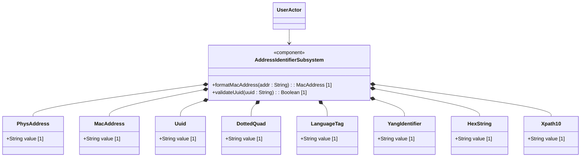

# Feature: Physical Addresses and Structural Identifiers

## Description
This feature specifies MAC addresses, physical address strings, UUIDs, language tags, and structural identifiers defined in RFC 9911.

## UML Class Diagram


## Interface Requirements
### 1. Test Data Shape / Payload Schema (JSON Example)
```json
{
  "identifiers": {
    "mac-address-val": "00:11:22:33:44:55",
    "uuid-val": "f81d4fae-7dec-11d0-a765-00a0c91e6bf6",
    "language-tag-val": "en-US"
  }
}
```

### 2. Validation & Constraints
- `mac-address`: MAC address in colon-separated octets format.
- `uuid`: Standard canonical 8-4-4-4-12 hex digit format.
- `language-tag`: BCP 47 language tag format.

### 3. Visual Layout & Arrangement / Logical Operations & Interface Messages
- **For UI**: Compact PropertyGrid displaying system config and structural addresses.
- **For API/M2M**: Exposes GET/PUT operations on `/metrics/identifiers`.

### 4. Interactive Flow & States / Logical Exception States & Validation Failures
- If MAC address has invalid separators (e.g. spaces), reject with constraint violation.
- If UUID regex validation fails, reject with an invalid identifier error.

## Given-When-Then Acceptance Criteria
- **Scenario 1: Format MAC address**
  Given a raw address input "001122334455"
  When formatMacAddress operation is called
  Then system formats and returns "00:11:22:33:44:55"

## Specification Context (Verbatim)
### `phys-address`
```
Represents media- or physical-level addresses represented
as a sequence of octets, each octet represented by two
hexadecimal numbers.  Octets are separated by colons.  The
canonical representation uses lowercase characters.

In the value set and its semantics, this type is equivalent
to the PhysAddress textual convention of the SMIv2.
```

### `mac-address`
```
The mac-address type represents a 48-bit IEEE 802 Media
Access Control (MAC) address.  The canonical representation
uses lowercase characters.  Note that there are IEEE 802 MAC
addresses with a different length that this type cannot
represent.  The phys-address type may be used to represent
physical addresses of varying length.

In the value set and its semantics, this type is equivalent
to the MacAddress textual convention of the SMIv2.
```

### `xpath1.0`
```
This type represents an XPATH 1.0 expression.

When a schema node is defined that uses this type, the
description of the schema node MUST specify the XPath
context in which the XPath expression is evaluated.
```

### `hex-string`
```
A hexadecimal string with octets represented as hex digits
separated by colons.  The canonical representation uses
lowercase characters.
```

### `uuid`
```
A Universally Unique IDentifier in the string representation
defined in RFC 9562.  The canonical representation uses
lowercase characters.

The following is an example of a UUID in string
representation:
f81d4fae-7dec-11d0-a765-00a0c91e6bf6.
```

### `dotted-quad`
```
An unsigned 32-bit number expressed in the dotted-quad
notation, i.e., four octets written as decimal numbers
and separated with the '.' (full stop) character.
```

### `language-tag`
```
A language tag according to RFC 5646 (BCP 47).  The
canonical representation uses lowercase characters.

Values of this type must be well-formed language tags,
in conformance with the definition of well-formed tags
in BCP 47.  Implementations MAY further limit the values
they accept to those permitted by a 'validating'
processor, as defined in BCP 47.

The canonical representation of values of this type is
aligned with the SMIv2 LangTag textual convention for
language tags fitting the length constraints imposed
by the LangTag textual convention.
```

### `yang-identifier`
```
A YANG identifier string as defined by the 'identifier'
rule in Section 14 of RFC 7950.  An identifier must
start with an alphabetic character or an underscore
followed by an arbitrary sequence of alphabetic or
numeric characters, underscores, hyphens, or dots.

This definition conforms to YANG 1.1 defined in RFC
7950.  In RFC 6991, this definition excluded
all identifiers starting with any possible combination
of the lowercase or uppercase character sequence 'xml',
as required by YANG 1 defined in RFC 6020.  If this type
is used in a YANG 1 context, then this restriction still
applies.
```

## Source References
Structural Schema: [schema/ietf-yang-types@2025-12-22.yang](file:///Users/perkunas/jail/dep-tst37/schema/ietf-yang-types@2025-12-22.yang)
Normative Specification: [RFC 9911](https://datatracker.ietf.org/doc/rfc9911/)

## 5. Logical UI & Layout Bindings
- **Target LUI Component:** PropertyGrid
- **Target Layout Container ID:** workspace_split
- **Data Source Bindings:** schema:ietf-yang-types/phys-address, schema:ietf-yang-types/mac-address, schema:ietf-yang-types/xpath1.0, schema:ietf-yang-types/hex-string, schema:ietf-yang-types/uuid, schema:ietf-yang-types/dotted-quad, schema:ietf-yang-types/language-tag, schema:ietf-yang-types/yang-identifier
