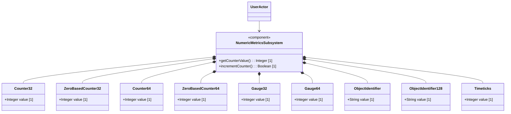

# Feature: Numeric and Identifier Metrics

## Description
This feature specifies numeric gauges, counters, object identifiers, and timeticks defined in RFC 9911.

## UML Class Diagram


## Interface Requirements
### 1. Test Data Shape / Payload Schema (JSON Example)
```json
{
  "metrics": {
    "counter-32-val": 4294967295,
    "gauge-32-val": 100,
    "object-identifier-val": "1.3.6.1.2.1.1.1.0"
  }
}
```

### 2. Validation & Constraints
- `counter32`: Monotonically increasing non-negative integer that wraps around at 2^32-1.
- `zero-based-counter32`: Non-negative counter32 initialized at zero.
- `gauge32`: Gauge that can increase or decrease, capped at 2^32-1.
- `object-identifier`: String pattern representing an OID.

### 3. Visual Layout & Arrangement / Logical Operations & Interface Messages
- **For UI**: High-density metric PropertyGrid layout container.
- **For API/M2M**: Exposes GET/PUT operations on `/metrics/numeric`.

### 4. Interactive Flow & States / Logical Exception States & Validation Failures
- If counter value wraps, fire rollover telemetry event.
- If OID does not match OID dot-separated numeric format, return an invalid parameter validation error.

## Given-When-Then Acceptance Criteria
- **Scenario 1: Increment Counter32**
  Given a counter initialized to 4294967294
  When increment counter operation is called
  Then counter wraps around to 0 and registers a rollover event

## Source References
Structural Schema: schema/ietf-yang-types@2025-12-22.yang
Normative Specification: https://datatracker.ietf.org/doc/base-rfc9179-rfc9911/
