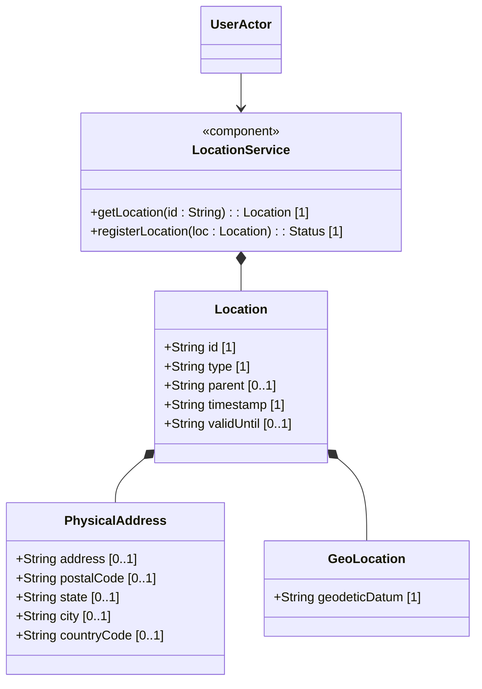

# Feature: Physical and Geographic Location Attributes

## Description
This feature defines attributes for network inventory locations, including parent-child hierarchy, physical postal addresses, geographic coordinates (datum, accuracy), and record timestamps.

## UML Class Diagram


## Interface Requirements
### 1. Test Data Shape / Payload Schema (JSON Example)
```json
{
  "location": {
    "id": "equipment-room-101",
    "type": "equipment-room",
    "parent": "building-north",
    "timestamp": "2026-06-21T18:00:00Z",
    "physical-address": {
      "address": "123 Technology Drive",
      "postal-code": "94016",
      "city": "San Francisco",
      "state": "California",
      "country-code": "US"
    }
  }
}
```

### 2. Validation & Constraints
- `id`: Unique location identifier.
- `country-code`: Must be exactly 2 uppercase letters matching `[A-Z]{2}` pattern (ISO ALPHA-2).
- `timestamp`: Must conform to `yang:date-and-time` standard.
- `valid-until`: Must conform to `yang:date-and-time`. If specified, must be greater than or equal to `timestamp`.

### 3. Visual Layout & Arrangement / Logical Operations & Interface Messages
- **For UI**: Displays locations list in `DensityTable` using layout container `history_pane`.
- **For API/M2M**: Exposes GET on `/locations` and `/locations/{id}` to read configuration.

### 4. Interactive Flow & States / Logical Exception States & Validation Failures
- If `country-code` does not match the 2-letter uppercase pattern, reject the request with a validation constraint violation.
- If `valid-until` represents a datetime prior to `timestamp`, reject the request with a validation constraint violation.

## Given-When-Then Acceptance Criteria
- **Scenario 1: Set location address and coordinates**
  Given a system ready for location registration
  When the client configures a location with country-code "US" and valid timestamps
  Then the system saves the location and returns success status

- **Scenario 2: Reject invalid country code**
  Given a location registration request
  When country-code is "USA" or "us"
  Then the system rejects the request with a validation constraint violation

## Source References
Structural Schema: schema/ietf-ni-location.yang
Normative Specification: https://datatracker.ietf.org/doc/html/draft-ietf-ivy-network-inventory-location
