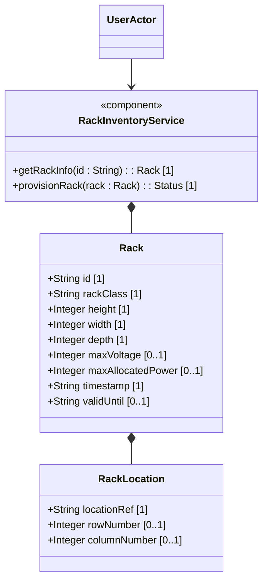

# Feature: Rack Structural Infrastructure

## Description
This feature defines physical specifications and configuration attributes for equipment racks, including classifications, row/column placement, dimensions, power limits, and validity.

## UML Class Diagram


## Interface Requirements
### 1. Test Data Shape / Payload Schema (JSON Example)
```json
{
  "rack": {
    "id": "rack-sec-05",
    "rack-class": "nil:rack-secure-high",
    "rack-location": {
      "location-ref": "equipment-room-101",
      "row-number": 3,
      "column-number": 4
    },
    "height": 2000,
    "width": 600,
    "depth": 1000,
    "max-voltage": 240,
    "max-allocated-power": 5000,
    "timestamp": "2026-06-21T18:00:00Z"
  }
}
```

### 2. Validation & Constraints
- `rack-class`: Must refer to an identity extending `rack-class-type` (e.g. `rack-standard`, `rack-secure-baseline`, `rack-secure-medium`, `rack-secure-high`).
- `height/width/depth`: Non-negative dimensions in millimeters.
- `max-voltage`: Non-negative maximum voltage supported by the rack in Volts.
- `max-allocated-power`: Non-negative maximum power in Watts.

### 3. Visual Layout & Arrangement / Logical Operations & Interface Messages
- **For UI**: Displays rack list in `DensityTable` using layout container `history_pane`.
- **For API/M2M**: Exposes GET/PUT operations on `/racks` and `/racks/{id}`.

### 4. Interactive Flow & States / Logical Exception States & Validation Failures
- If `rack-class` does not derive from `rack-class-type`, reject the request with a validation constraint violation.
- If physical dimensions are negative or zero, reject the request with a validation constraint violation.

## Given-When-Then Acceptance Criteria
- **Scenario 1: Provision secure rack**
  Given a configured location "equipment-room-101"
  When the client provisions a rack with class "nil:rack-secure-high" and dimensions 2000x600x1000
  Then the system saves the rack and returns success status

## Specification Context (Verbatim)
"Top-level container for the list of racks. List of racks within the inventory (e.g., in an equipment room)."

## 4. Source References
Structural Schema: [ietf-ni-location.yang](file:///Users/perkunas/jail/dep-tst37/schema/ietf-ni-location.yang)
Normative Specification: [draft-ietf-ivy-network-inventory-location](https://datatracker.ietf.org/doc/html/draft-ietf-ivy-network-inventory-location)

## 5. Logical UI & Layout Bindings
- **Target LUI Component:** DensityTable
- **Target Layout Container ID:** history_pane
- **Data Source Bindings:** schema:generic-topology/topology/element[@id='active_focused_element']/racks/rack
