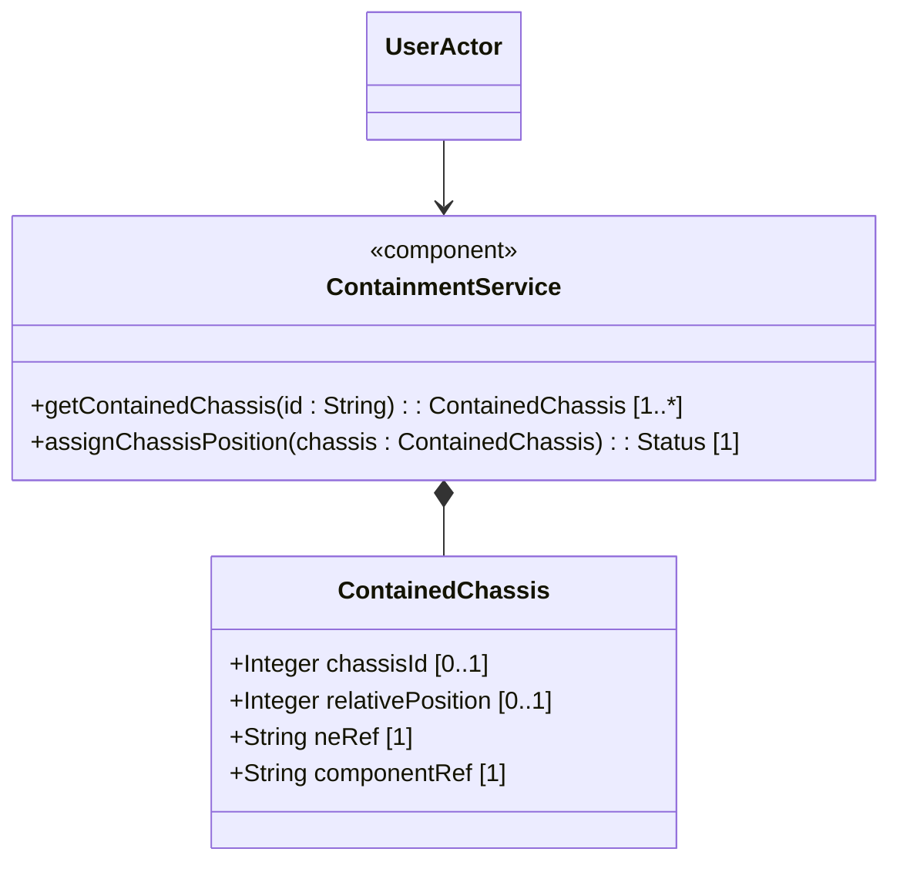

# Feature: Distributed Chassis Layout and Containment

## Description
This feature defines physical containment links for active equipment chassis, mapping them to location containers (for distributed or un-racked chassis) or specific rack slot relative positions.

## UML Class Diagram


## Interface Requirements
### 1. Test Data Shape / Payload Schema (JSON Example)
```json
{
  "contained-chassis": {
    "relative-position": 42,
    "ne-ref": "/nwi:network-inventory/nwi:network-elements/nwi:network-element[nwi:ne-id='ne-core-01']",
    "component-ref": "/nwi:network-inventory/nwi:network-elements/nwi:network-element[nwi:ne-id='ne-core-01']/nwi:components/nwi:component[nwi:component-id='chassis-1']"
  }
}
```

### 2. Validation & Constraints
- `chassis-id`: Unique identifier (uint32) when deployed inside a location container without a rack.
- `relative-position`: Relative U-slot index (uint8) when deployed inside a rack container.
- `ne-ref`: Must point to a valid `/nwi:network-inventory/nwi:network-elements/nwi:network-element/nwi:ne-id`.
- `component-ref`: Must point to a valid chassis component associated with the referenced network element.

### 3. Visual Layout & Arrangement / Logical Operations & Interface Messages
- **For UI**: Compact PropertyGrid displaying chassis slot alignment inside the rack visualization pane.
- **For API/M2M**: Exposes GET/PUT operations on `/locations/{loc-id}/contained-chassis` and `/racks/{rack-id}/contained-chassis`.

### 4. Interactive Flow & States / Logical Exception States & Validation Failures
- If `relative-position` conflicts with an already populated slot, reject the request with a validation constraint violation.
- If network element or component references fail leafref constraints, reject the request with an invalid parameter validation error.

## Given-When-Then Acceptance Criteria
- **Scenario 1: Mount chassis in rack**
  Given an active rack "rack-sec-05"
  When the client deploys a chassis at relative-position 42 pointing to a valid network element and component
  Then the system maps the chassis to the U-slot and returns success status

## Source References
Structural Schema: [ietf-ni-location.yang](file:///Users/perkunas/jail/dep-tst37/schema/ietf-ni-location.yang)
Normative Specification: https://datatracker.ietf.org/doc/html/draft-ietf-ivy-network-inventory-location
