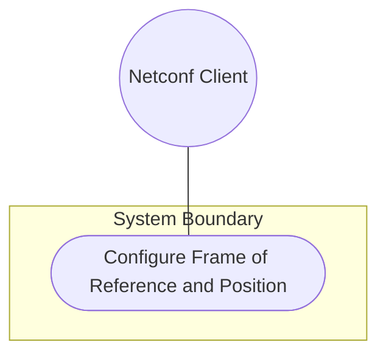
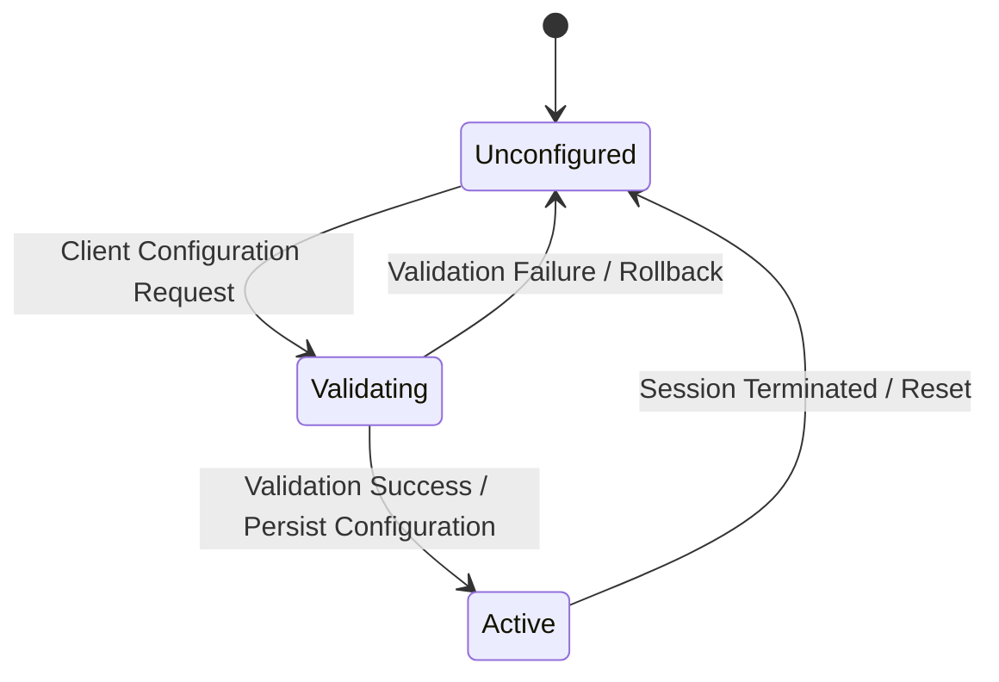

# Use Case: Configure Frame of Reference and Position

## 1. Actors
- **Primary Actor:** Netconf Client
- **Secondary Actors:** None

## 2. Preconditions
- Netconf session established.

## 3. Trigger
Client initiates configuration request for reference frame or coordinates.

## 4. Main Success Scenario (Basic Flow)
1. Client sends spatial reference frame parameters (astronomical body, geodetic datum) and position coordinates.
2. System validates the format of reference frame attributes against schema patterns.
3. System validates coordinate fields based on mutual exclusivity choice (ellipsoid vs Cartesian).
4. System validates coordinate ranges and decimal precision.
5. System stores position values in the persistent datastore.
6. System returns a success confirmation payload to the client.

## 5. Alternate and Exception Flows
- **5a. Invalid astronomical-body pattern (Branches from Basic Flow step 2):**
  1. System validates the `astronomical-body` attribute format.
  2. System detects characters outside the allowed ASCII pattern `[ -@\[-\^_-~]*`, aborts the transaction, and returns a constraint-violation error.
  *Failure Guarantee:* The transaction is aborted, system configuration rolls back to the previous state, and the Netconf Client is notified of the pattern constraint violation.
- **5b. Invalid geodetic-datum pattern (Branches from Basic Flow step 2):**
  1. System validates the `geodetic-datum` attribute format.
  2. System detects characters outside the allowed ASCII pattern `[ -@\[-\^_-~]*`, aborts the transaction, and returns a constraint-violation error.
  *Failure Guarantee:* The transaction is aborted, system configuration rolls back to the previous state, and the Netconf Client is notified of the datum pattern violation.
- **5c. Coordinate accuracy precision exceeds 6 fraction digits (Branches from Basic Flow step 2):**
  1. System validates the `coord-accuracy` decimal64 value.
  2. System detects that the fraction-digits count exceeds 6, aborts the transaction, and returns a constraint-violation error.
  *Failure Guarantee:* The transaction is aborted, system configuration rolls back to the previous state, and the Netconf Client is notified of the coordinate accuracy precision error.
- **5d. Height accuracy precision exceeds 6 fraction digits (Branches from Basic Flow step 2):**
  1. System validates the `height-accuracy` decimal64 value.
  2. System detects that the fraction-digits count exceeds 6, aborts the transaction, and returns a constraint-violation error.
  *Failure Guarantee:* The transaction is aborted, system configuration rolls back to the previous state, and the Netconf Client is notified of the height accuracy precision error.
- **5e. Both ellipsoid and cartesian cases provided (Branches from Basic Flow step 3):**
  1. System validates the mutual exclusivity of the coordinate choice.
  2. System detects that both the `ellipsoid` and `cartesian` containers are populated, aborts the transaction, and returns a choice-exclusive-violation error.
  *Failure Guarantee:* The transaction is aborted, system configuration rolls back to the previous state, and the Netconf Client is notified of the mutual exclusivity violation.
- **5f. Latitude value out of [-90..90] bounds (Branches from Basic Flow step 4):**
  1. System validates the range of the `latitude` value.
  2. System detects that the latitude is outside the valid range of -90 to +90 decimal degrees, aborts the transaction, and returns a range-violation error.
  *Failure Guarantee:* The transaction is aborted, system configuration rolls back to the previous state, and the Netconf Client is notified of the latitude range violation.
- **5g. Longitude value out of [-180..180] bounds (Branches from Basic Flow step 4):**
  1. System validates the range of the `longitude` value.
  2. System detects that the longitude is outside the valid range of -180 to +180 decimal degrees, aborts the transaction, and returns a range-violation error.
  *Failure Guarantee:* The transaction is aborted, system configuration rolls back to the previous state, and the Netconf Client is notified of the longitude range violation.
- **5h. Ellipsoid height precision exceeds 6 fraction digits (Branches from Basic Flow step 4):**
  1. System validates the precision of the ellipsoidal `height` value.
  2. System detects that the fraction-digits count exceeds 6, aborts the transaction, and returns a constraint-violation error.
  *Failure Guarantee:* The transaction is aborted, system configuration rolls back to the previous state, and the Netconf Client is notified of the ellipsoidal height precision error.
- **5i. Cartesian x/y/z precision exceeds 6 fraction digits (Branches from Basic Flow step 4):**
  1. System validates the precision of the Cartesian `x`, `y`, or `z` coordinate values.
  2. System detects that any component has a fraction-digits count exceeding 6, aborts the transaction, and returns a constraint-violation error.
  *Failure Guarantee:* The transaction is aborted, system configuration rolls back to the previous state, and the Netconf Client is notified of the Cartesian coordinate precision error.

## 6. Postconditions (Guarantees)
- **Success Guarantee:** The spatial reference frame and position coordinates are successfully validated, saved in the persistent datastore, and applied to the active subsystem state.
- **Failure Guarantee:** The system state is rolled back, no changes are committed to the datastore, and a detailed validation or constraint violation error is returned to the client.

## UML Diagrams
### Use Case Diagram

### State Machine Diagram

## 7. Operational Context
> "The frame of reference ('reference-frame') defines what the location values refer to and their meaning. The referred-to object can be any astronomical body. The default 'astronomical-body' value is 'earth'." (from [feat-01-reference-frame.md](file:///Users/perkunas/jail/dep-tst37/docs/features/feat-01-reference-frame.md))

> "This is the location on, or relative to, the astronomical object. It is specified using two or three coordinate values. These values are given either as 'latitude', 'longitude', and an optional 'height', or as Cartesian coordinates of 'x', 'y', and 'z'." (from [feat-02-geographic-position.md](file:///Users/perkunas/jail/dep-tst37/docs/features/feat-02-geographic-position.md))

## 8. Realization Matrix
### Required User Stories
- [ ] #5 - [Ellipsoidal Positioning on Earth](https://github.com/gintatkinson/dep-tst37/blob/main/docs/user-stories/us-01-ellipsoidal-positioning.md) ([us-01-ellipsoidal-positioning.md](file:///Users/perkunas/jail/dep-tst37/docs/user-stories/us-01-ellipsoidal-positioning.md)) (Realizes standard GPS coordinate setup)
- [ ] #6 - [Cartesian Coordinate Positioning](https://github.com/gintatkinson/dep-tst37/blob/main/docs/user-stories/us-02-cartesian-positioning.md) ([us-02-cartesian-positioning.md](file:///Users/perkunas/jail/dep-tst37/docs/user-stories/us-02-cartesian-positioning.md)) (Realizes 3D spatial positioning)
- [ ] #7 - [Alternate Reference System Simulation](https://github.com/gintatkinson/dep-tst37/blob/main/docs/user-stories/us-03-alternate-reference-system.md) ([us-03-alternate-reference-system.md](file:///Users/perkunas/jail/dep-tst37/docs/user-stories/us-03-alternate-reference-system.md)) (Realizes alternate simulations)

### Required Features
- [ ] #1 - [Reference Frame Configuration](https://github.com/gintatkinson/dep-tst37/blob/main/docs/features/feat-01-reference-frame.md) ([feat-01-reference-frame.md](file:///Users/perkunas/jail/dep-tst37/docs/features/feat-01-reference-frame.md)) (Provides geodetic systems settings)
- [ ] #2 - [Geographic Position Resolution](https://github.com/gintatkinson/dep-tst37/blob/main/docs/features/feat-02-geographic-position.md) ([feat-02-geographic-position.md](file:///Users/perkunas/jail/dep-tst37/docs/features/feat-02-geographic-position.md)) (Provides spatial coordinates settings)

## Source References
Structural Schema: [ietf-geo-location@2022-02-11.yang](file:///Users/perkunas/jail/dep-tst37/schema/ietf-geo-location@2022-02-11.yang)
Normative Specification: [RFC 9179](https://datatracker.ietf.org/doc/rfc9179/)
