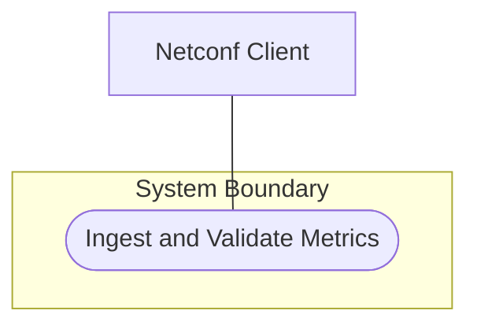
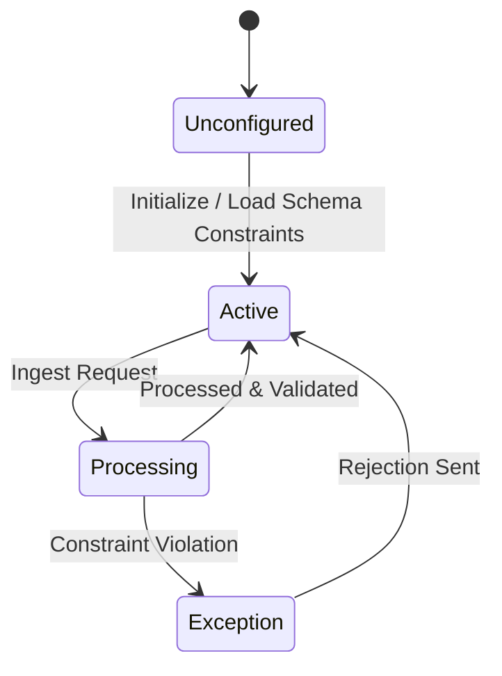

# Use Case: Ingest and Validate Metrics

## 1. Actors
- **Primary Actor:** Netconf Client
- **Secondary Actor:** None

## 2. Preconditions
- Netconf session is established and authenticated.

## 3. Trigger
- Client initiates a telemetry ingestion request containing numeric metrics and structural identifiers.

---

## 4. Main Success Scenario
1. **Client** submits a telemetry metrics payload containing Counter32, Gauge32, ObjectIdentifier, and MacAddress values.
2. **System** parses the payload according to standard RFC 9911 schema nodes.
3. **System** validates that Counter32/64 values are non-negative and increment monotonically.
4. **System** validates that Gauge32/64 values are within limits.
5. **System** validates that ObjectIdentifier matches the dot-separated OID format pattern.
6. **System** validates MAC address and UUID format structures.
7. **System** updates internal datastore with the validated values.
8. **System** returns a success confirmation response to the client.

---

## 5. Alternate and Exception Flows

* **3a. Counter32/64 value is negative** (Branches from step 3):
  1. System detects that counter value is less than 0.
  2. System rejects the transaction and returns a validation exception response.

* **3b. Counter32/64 rollover** (Branches from step 3):
  1. System detects counter wraps around.
  2. System registers a rollover event and resets counter value to 0.

* **4a. Gauge32/64 exceeds maximum value** (Branches from step 4):
  1. System detects gauge value is greater than 2^32-1.
  2. System caps the value at the maximum threshold and logs a warning.

* **5a. ObjectIdentifier format pattern mismatch** (Branches from step 5):
  1. System detects OID string violates dot-separated numeric format.
  2. System rejects request with an invalid parameter validation error.

* **6a. MAC address format invalid** (Branches from step 6):
  1. System detects MAC address contains invalid separators.
  2. System rejects request with a validation constraint violation.

* **6b. UUID format invalid** (Branches from step 6):
  1. System detects UUID string violates RFC 9562 pattern.
  2. System rejects request with an invalid identifier error.

* **6c. Language tag format invalid** (Branches from step 6):
  1. System detects language-tag violates BCP 47 pattern.
  2. System rejects request with a validation constraint violation.

---

## 6. Postconditions
- **Success Guarantee:** The telemetry metrics payload is successfully parsed, validated, and saved to the internal datastore. A success confirmation response is returned to the client.
- **Failure Guarantee:** Invalid payloads are rejected. No modifications are made to the internal datastore. A detailed validation exception response is returned to the client.

---

## UML Diagrams

### Use Case Diagram

### State Machine Diagram

---

## 8. Realization Matrix

### Required User Stories
- [ ] #16 - [Counter and Gauge Operations](https://github.com/gintatkinson/dep-tst37/blob/rfc9911/docs/user-stories/us-01-counter-gauge-ops.md) (Verifies counter and gauge logic)
- [ ] #18 - [Address Parsing](https://github.com/gintatkinson/dep-tst37/blob/rfc9911/docs/user-stories/us-03-address-parsing.md) (Verifies MAC address and UUID validation)

### Required Features
- [ ] #12 - [Numeric and Identifier Metrics](https://github.com/gintatkinson/dep-tst37/blob/rfc9911/docs/features/feat-01-numeric-metrics.md) (Defines counter/gauge validation constraints)
- [ ] #14 - [Physical Addresses and Structural Identifiers](https://github.com/gintatkinson/dep-tst37/blob/rfc9911/docs/features/feat-03-physical-structural.md) (Defines MAC/UUID/address validation constraints)

---

## Source References
- **Structural Schema:** [ietf-yang-types@2025-12-22.yang](file:///Users/perkunas/jail/dep-tst37/schema/ietf-yang-types@2025-12-22.yang)
- **Normative Specification:** [RFC 9911](https://datatracker.ietf.org/doc/rfc9911/)
