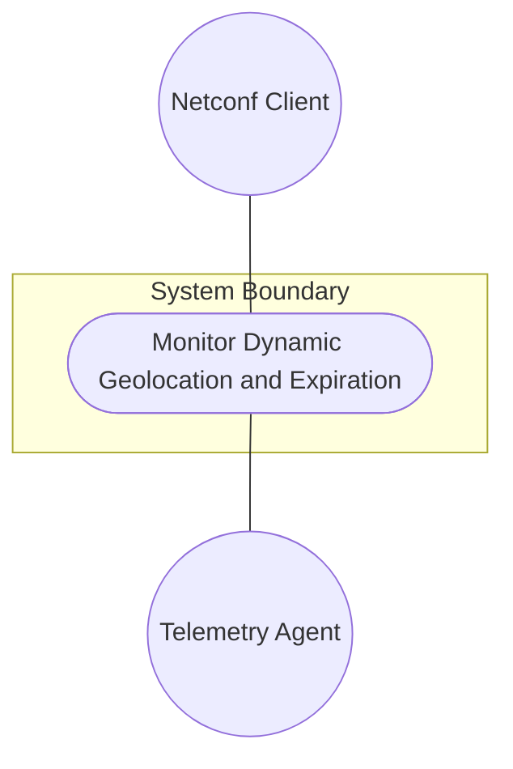
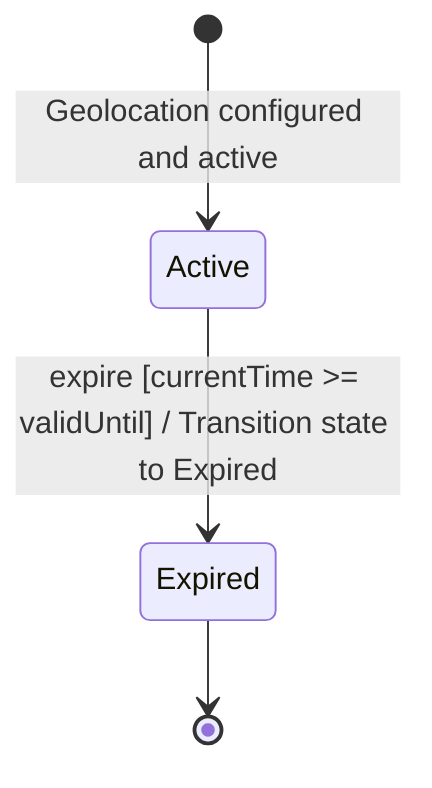

# Use Case: Monitor Dynamic Geolocation and Expiration

## 1. Actors
- **Primary Actor:** Netconf Client
- **Secondary Actor:** Telemetry Agent

## 2. Preconditions
- Geolocation configured and active.

## 3. Trigger
Telemetry agent streams dynamic velocity vector updates.

## 4. Main Success Scenario (Basic Flow)
1. Telemetry Agent streams current 3D velocity vectors (v-north, v-east, v-up), timestamp, and validity limit (valid-until).
2. System validates velocity vector accuracies and decimal constraints.
3. System validates temporal range (valid-until >= timestamp).
4. System computes derived speed and heading using formulas:
   speed = sqrt(v_north^2 + v_east^2)
   heading = arctan(v_east / v_north)
5. System updates active position state and records telemetry events in logs.
6. Client queries active status and receives dynamic coordinates, calculated speed/heading, and validity status.

## 5. Alternate and Exception Flows
- **5a. v-north precision exceeds 12 fraction digits** (Branches from step 2):
  1. System detects that `v-north` has more than 12 fraction digits, violating the decimal64 precision constraint.
  2. System rejects the telemetry update, records a validation failure event in logs, and returns an error response with code 400 and type "invalid-precision" to the Telemetry Agent (original position state is preserved).
- **5b. v-east precision exceeds 12 fraction digits** (Branches from step 2):
  1. System detects that `v-east` has more than 12 fraction digits, violating the decimal64 precision constraint.
  2. System rejects the telemetry update, records a validation failure event in logs, and returns an error response with code 400 and type "invalid-precision" to the Telemetry Agent (original position state is preserved).
- **5c. v-up precision exceeds 12 fraction digits** (Branches from step 2):
  1. System detects that `v-up` has more than 12 fraction digits, violating the decimal64 precision constraint.
  2. System rejects the telemetry update, records a validation failure event in logs, and returns an error response with code 400 and type "invalid-precision" to the Telemetry Agent (original position state is preserved).
- **5d. valid-until timestamp is prior to timestamp** (Branches from step 3):
  1. System detects that the `valid-until` timestamp is chronologically prior to the measurement `timestamp`.
  2. System rejects the telemetry update, records a validation failure event in logs, and returns an error response with code 400 and type `invalid-temporal-range` on path `/valid-until` to the Telemetry Agent (original position state is preserved).
- **5e. Current system time exceeds valid-until timestamp** (Branches from step 6):
  1. System detects that the current system time is greater than or equal to the `valid-until` timestamp.
  2. System transitions the location state to `Expired`, logs the expiration event, and returns a validation exception on the coordinate query to the Netconf Client.

## 6. Postconditions (Guarantees)
- **Success Guarantee:** Active position state is updated with 3D velocity vectors, timestamp, and valid-until; speed and heading are computed; and Netconf Client receives valid dynamic coordinates, speed, heading, and active validity status.
- **Failure Guarantee:** Telemetry update is rejected, state remains unchanged (original position state is preserved), error details are logged, and actors are notified of validation/temporal failures. If expired, state transitions to Expired and subsequent queries are rejected.

## UML Diagrams
### Use Case Diagram

### State Machine Diagram

## 7. Operational Context
Verbatim from RFC 9179, Section 2.3 (Motion):
> To derive the two-dimensional heading and speed, one would use the following formulas:
> 
>               ,------------------------------
>     speed =  V  v_{north}^{2} + v_{east}^{2}
> 
>     heading = arctan(v_{east} / v_{north})

Verbatim from the `schema/ietf-geo-location@2022-02-11.yang` schema:
> The timestamp for which this geo-location is valid until. If unspecified, the geo-location has no specific expiration time.
>
> If the object is in motion, the velocity vector describes this motion at the time given by the timestamp. For a formula to convert these values to speed and heading, see RFC 9179.

## 8. Realization Matrix
### Required User Stories
- [ ] #8 - [Velocity Vector to Speed and Heading Calculation](https://github.com/gintatkinson/dep-tst37/blob/main/docs/user-stories/us-04-velocity-calculations.md) (Realizes derived dynamics calculations)
- [ ] #9 - [Geolocation Temporal Expiration](https://github.com/gintatkinson/dep-tst37/blob/main/docs/user-stories/us-05-temporal-expiration.md) (Realizes temporal expiration check)

### Required Features
- [ ] #3 - [Geolocation Dynamics and Temporal Context](https://github.com/gintatkinson/dep-tst37/blob/main/docs/features/feat-03-dynamics-temporal.md) (Provides velocity and temporal attributes)

## Source References
Structural Schema: [ietf-geo-location@2022-02-11.yang](file:///Users/perkunas/jail/dep-tst37/schema/ietf-geo-location@2022-02-11.yang)
Normative Specification: [RFC 9179](https://datatracker.ietf.org/doc/rfc9179/)
