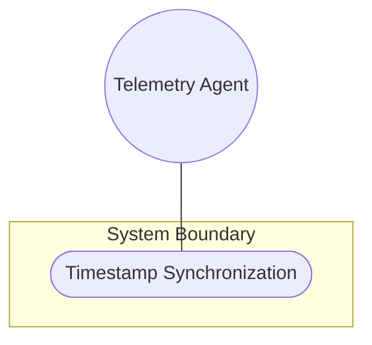
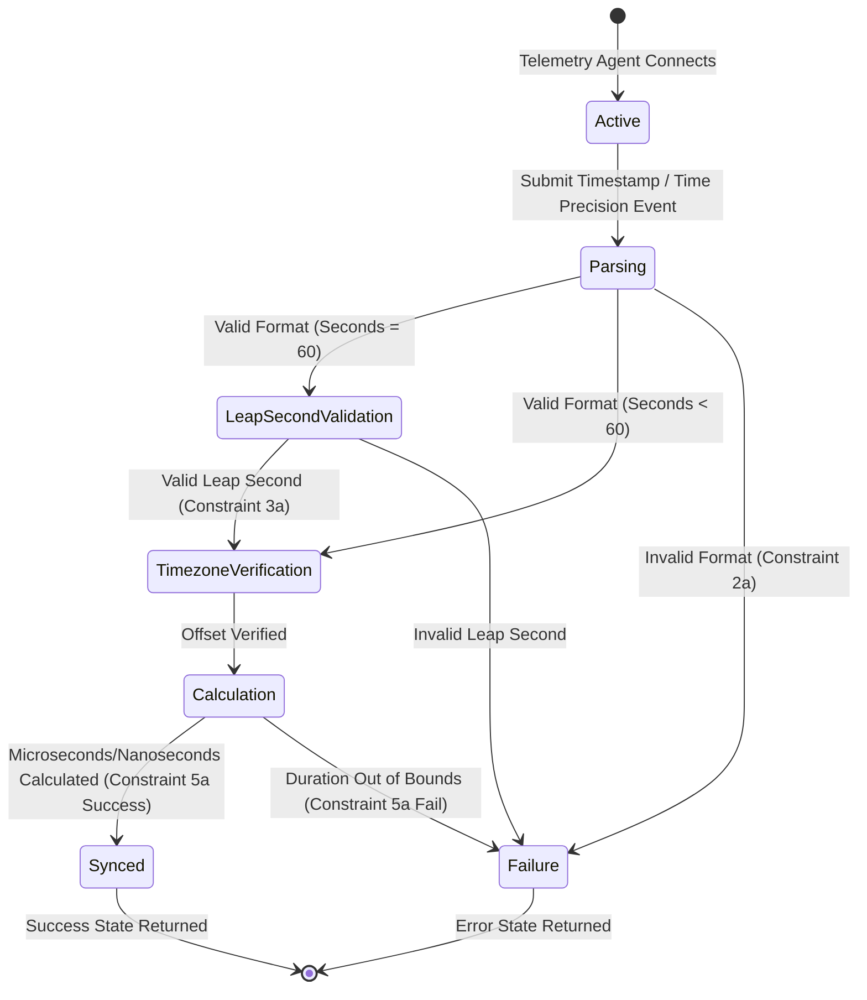

# Use Case: Timestamp Synchronization

## 1. Actors
- **Primary Actor:** [Telemetry Agent](file:///Users/perkunas/jail/dep-tst37/docs/features/feat-02-temporal-precision.md#L18)
- **Secondary Actors:** None

## 2. Preconditions
- The [Telemetry Agent](file:///Users/perkunas/jail/dep-tst37/docs/features/feat-02-temporal-precision.md#L18) is authenticated and connected.
- The system's [TemporalSubsystem](file:///Users/perkunas/jail/dep-tst37/docs/features/feat-02-temporal-precision.md#L20) is initialized and active.

## 3. Trigger
The [Telemetry Agent](file:///Users/perkunas/jail/dep-tst37/docs/features/feat-02-temporal-precision.md#L18) streams timestamp updates or time precision events.

## 4. Main Success Scenario (Basic Flow)
1. [Telemetry Agent](file:///Users/perkunas/jail/dep-tst37/docs/features/feat-02-temporal-precision.md#L18) submits a temporal dataset or high-precision timestamp to the [TemporalSubsystem](file:///Users/perkunas/jail/dep-tst37/docs/features/feat-02-temporal-precision.md#L20).
2. The [TemporalSubsystem](file:///Users/perkunas/jail/dep-tst37/docs/features/feat-02-temporal-precision.md#L20) parses the date and time format according to ISO 8601 / RFC 3339.
3. The [TemporalSubsystem](file:///Users/perkunas/jail/dep-tst37/docs/features/feat-02-temporal-precision.md#L20) handles leap seconds if the seconds component is 60.
4. The [TemporalSubsystem](file:///Users/perkunas/jail/dep-tst37/docs/features/feat-02-temporal-precision.md#L20) verifies the timezone offset.
5. The [TemporalSubsystem](file:///Users/perkunas/jail/dep-tst37/docs/features/feat-02-temporal-precision.md#L20) calculates the precise temporal interval or duration in nanoseconds or microseconds using [nanoseconds64](file:///Users/perkunas/jail/dep-tst37/schema/ietf-yang-types@2025-12-22.yang#L568) / [microseconds64](file:///Users/perkunas/jail/dep-tst37/schema/ietf-yang-types@2025-12-22.yang#L49).
6. The [TemporalSubsystem](file:///Users/perkunas/jail/dep-tst37/docs/features/feat-02-temporal-precision.md#L20) updates the temporal synchronization logs.
7. The [TemporalSubsystem](file:///Users/perkunas/jail/dep-tst37/docs/features/feat-02-temporal-precision.md#L20) returns the success state to the [Telemetry Agent](file:///Users/perkunas/jail/dep-tst37/docs/features/feat-02-temporal-precision.md#L18).

## 5. Alternate and Exception Flows
- **2a. DateTime fails ISO 8601 parsing** (Branches from Basic Flow step 2):
  1. The [TemporalSubsystem](file:///Users/perkunas/jail/dep-tst37/docs/features/feat-02-temporal-precision.md#L20) detects that the date-and-time string violates RFC 3339/9557 format.
  2. The [TemporalSubsystem](file:///Users/perkunas/jail/dep-tst37/docs/features/feat-02-temporal-precision.md#L20) rejects the timestamp with a validation constraint violation, logs the formatting error, and returns a failure status.
- **3a. Leap second parsing** (Branches from Basic Flow step 3):
  1. The [TemporalSubsystem](file:///Users/perkunas/jail/dep-tst37/docs/features/feat-02-temporal-precision.md#L20) detects a timestamp with the seconds field equal to 60.
  2. The [TemporalSubsystem](file:///Users/perkunas/jail/dep-tst37/docs/features/feat-02-temporal-precision.md#L20) validates the leap second against epoch alignment, registers the synchronization event, and transitions to step 4 of the Main Success Scenario.
- **5a. High-precision duration out of bounds** (Branches from Basic Flow step 5):
  1. The [TemporalSubsystem](file:///Users/perkunas/jail/dep-tst37/docs/features/feat-02-temporal-precision.md#L20) detects that the [nanoseconds64](file:///Users/perkunas/jail/dep-tst37/schema/ietf-yang-types@2025-12-22.yang#L568) value is negative or overflows the 64-bit signed integer limit.
  2. The [TemporalSubsystem](file:///Users/perkunas/jail/dep-tst37/docs/features/feat-02-temporal-precision.md#L20) rejects the value with a range validation error, logs the out-of-bounds error, and returns a failure status.

## 6. Postconditions (Guarantees)
- **Success Guarantee:** The high-precision timestamp is parsed, validated, and logged, and the precise interval calculation is successfully stored and reported.
- **Failure Guarantee:** The system rejects the invalid timestamp or out-of-bounds interval, does not modify any synchronization logs, and returns a descriptive error state.

## UML Diagrams
### Use Case Diagram

### State Machine Diagram

## 7. Operational Context
> The `date-and-time` type is a profile of the ISO 8601 standard for representation of dates and times using the Gregorian calendar. The profile is defined by the date-time production in Section 5.6 of RFC 3339 and the update defined in Section 2 of RFC 9557. The value of 60 for seconds is allowed only in the case of leap seconds.
> 
> The date-and-time type is compatible with the dateTime XML schema dateTime type with the following notable exceptions:
> (a) The date-and-time type does not allow negative years.
> (b) The time-offset Z indicates that the date-and-time value is reported in UTC and that the local time zone reference point is unknown. The time-offset +00:00 indicates that the date-and-time value is reported in UTC and that the local time zone reference point is UTC (see Section 2 of RFC 9557).
> 
> -- Quoted verbatim from [ietf-yang-types@2025-12-22.yang](file:///Users/perkunas/jail/dep-tst37/schema/ietf-yang-types@2025-12-22.yang#L311-L328)

> A period of time measured in units of 10^-9 seconds.
> The maximum time period that can be expressed is in the range [-106753 days 23:12:44 to 106752 days 0:47:16].
> This type should be range-restricted in situations where only non-negative time periods are desirable (i.e., range '0..max').
> 
> -- Quoted verbatim from [ietf-yang-types@2025-12-22.yang](file:///Users/perkunas/jail/dep-tst37/schema/ietf-yang-types@2025-12-22.yang#L571-L579)

## 8. Realization Matrix
### Required User Stories
- [ ] #17 - [Precision Temporal Tracking](https://github.com/gintatkinson/dep-tst37/blob/rfc9911/docs/user-stories/us-02-precision-temporal-tracking.md) (Verifies high-precision timestamp handling in the system)
### Required Features
- [ ] #13 - [Date, Time, and Temporal Precision](https://github.com/gintatkinson/dep-tst37/blob/rfc9911/docs/features/feat-02-temporal-precision.md) (Defines temporal validation and parsing constraints)

## Source References
Structural Schema: [ietf-yang-types@2025-12-22.yang](file:///Users/perkunas/jail/dep-tst37/schema/ietf-yang-types@2025-12-22.yang)
Normative Specification: [RFC 9911](https://datatracker.ietf.org/doc/rfc9911/)
