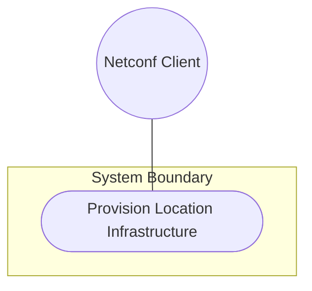
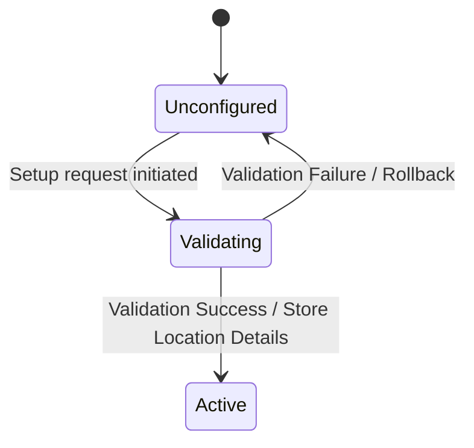

# Use Case: Provision Location Infrastructure

## 1. Actors
- **Primary Actor:** Netconf Client
- **Secondary Actors:** None

## 2. Preconditions
- Netconf session established and authenticated.

## 3. Trigger
Client initiates location infrastructure setup request containing physical address and geographic coordinate details.

## 4. Main Success Scenario (Basic Flow)
1. Client submits a location payload containing location id, type, parent hierarchy, physical-address details, and geo-location coordinates.
2. System parses the payload according to standard RFC 9911 / ietf-ni-location schemas.
3. System validates that the location ID is unique.
4. System validates the physical-address details (street, city, state, postal-code).
5. System validates the country-code against ISO ALPHA-2 2-letter uppercase pattern.
6. System validates the geographic coordinates and geodetic datum.
7. System validates timestamps and validity limits.
8. System stores location details in the datastore and returns success status.

## 5. Alternate and Exception Flows
- **3a. Non-unique Location ID (Branches from Basic Flow step 3):**
  1. System detects that the location ID already exists in the datastore.
  2. System rejects the request with an invalid parameter validation error.
  *Failure Guarantee:* The transaction is aborted, the database transaction is rolled back with no changes stored, and the client is notified of the non-unique location ID.
- **5a. Country-code format pattern mismatch (Branches from Basic Flow step 5):**
  1. System detects that country-code is not exactly 2 uppercase letters.
  2. System rejects the request with a validation constraint violation.
  *Failure Guarantee:* The transaction is aborted, the database transaction is rolled back, and the client is notified of the country-code format pattern mismatch.
- **7a. Invalid timestamp format (Branches from Basic Flow step 7):**
  1. System detects that timestamp does not conform to yang:date-and-time format.
  2. System rejects the request with a validation constraint violation.
  *Failure Guarantee:* The transaction is aborted, the database transaction is rolled back, and the client is notified of the invalid timestamp format.
- **7b. valid-until timestamp is prior to timestamp (Branches from Basic Flow step 7):**
  1. System detects that valid-until represents a datetime earlier than timestamp.
  2. System rejects the request with a validation constraint violation.
  *Failure Guarantee:* The transaction is aborted, the database transaction is rolled back, and the client is notified that the validity limit is prior to the timestamp.

## 6. Postconditions (Guarantees)
- **Success Guarantee:** Location details are successfully validated and stored in the datastore, and a success status is returned to the client.
- **Failure Guarantee:** The transaction is aborted, no changes are committed to the datastore, and the client is notified of the validation or constraint violation.

## UML Diagrams
### Use Case Diagram

### State Machine Diagram

## 7. Operational Context
> "This feature defines attributes for network inventory locations, including parent-child hierarchy, physical postal addresses, geographic coordinates (datum, accuracy), and record timestamps." (from [feat-07-physical-geographic-location.md](file:///Users/perkunas/jail/dep-tst37/docs/features/feat-07-physical-geographic-location.md))

> "Specifies a country. Expressed as ISO ALPHA-2 code." (from [ietf-ni-location.yang](file:///Users/perkunas/jail/dep-tst37/schema/ietf-ni-location.yang#L147-L148))

> "The identifier of the location that physically contains this location." (from [ietf-ni-location.yang](file:///Users/perkunas/jail/dep-tst37/schema/ietf-ni-location.yang#L185-L187))

## 8. Realization Matrix
### Required User Stories
- [ ] #25 - [Physical Address Validation and Location Hierarchy](https://github.com/gintatkinson/dep-tst37/blob/ietf-ni-location/docs/user-stories/us-09-physical-address-hierarchy.md) ([us-09-physical-address-hierarchy.md](file:///Users/perkunas/jail/dep-tst37/docs/user-stories/us-09-physical-address-hierarchy.md)) (Verifies parent-child linking and country validation)

### Required Features
- [ ] #21 - [Physical and Geographic Location Attributes](https://github.com/gintatkinson/dep-tst37/blob/ietf-ni-location/docs/features/feat-07-physical-geographic-location.md) ([feat-07-physical-geographic-location.md](file:///Users/perkunas/jail/dep-tst37/docs/features/feat-07-physical-geographic-location.md)) (Provides schema nodes for locations and addresses)

## Source References
Structural Schema: [ietf-ni-location.yang](file:///Users/perkunas/jail/dep-tst37/schema/ietf-ni-location.yang)
Normative Specification: [draft-ietf-ivy-network-inventory-location](https://datatracker.ietf.org/doc/html/draft-ietf-ivy-network-inventory-location)
