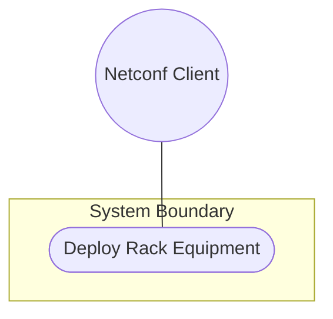
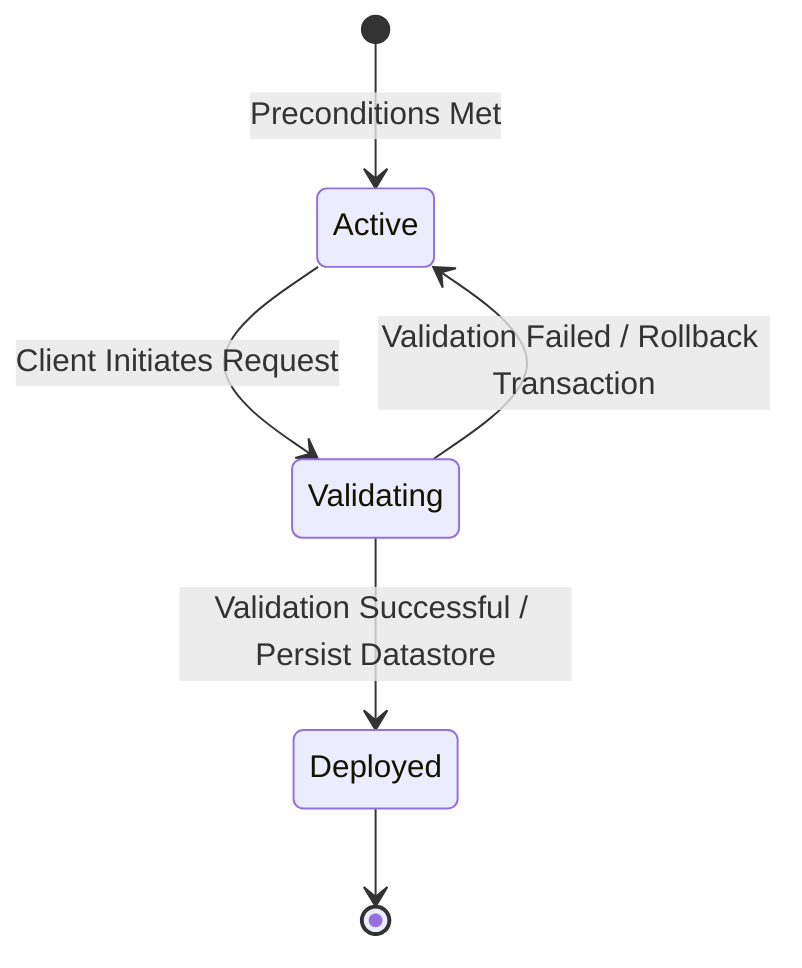

# Use Case: Deploy Rack Equipment

## 1. Actors
- **Primary Actor:** Netconf Client
- **Secondary Actors:** None

## 2. Preconditions
- Locations configured.
- Network element component definitions active.

## 3. Trigger
Client initiates request to provision a rack and deploy chassis components in it.

## 4. Main Success Scenario (Basic Flow)
1. Client submits a rack payload containing rack id, classification, dimensions, electrical limits, and slot assignments for chassis components.
2. System parses the payload according to standard ietf-ni-location schemas.
3. System validates that the rack ID is unique.
4. System validates the rack classification against rack-class-type identities.
5. System validates the physical dimensions (height, width, depth).
6. System validates the max-voltage and max-allocated-power limits.
7. System validates chassis relative-position slot and checks that it is unoccupied.
8. System validates network element references (ne-ref) and component references (component-ref).
9. System registers the rack and deploys the chassis components in the datastore, returning success status.

## 5. Alternate and Exception Flows
- **4a. Invalid rack-class identity (Branches from Basic Flow step 4):**
  1. System detects rack-class does not extend rack-class-type.
  2. System rejects request with a validation constraint violation.
  *Failure Guarantee:* The transaction is aborted, the rack registration is rejected, the datastore remains unmodified, and the Netconf Client is notified of the invalid rack-class identity.
- **5a. Physical dimensions out of bounds (Branches from Basic Flow step 5):**
  1. System detects height, width, or depth is negative or zero.
  2. System rejects request with a validation constraint violation.
  *Failure Guarantee:* The transaction is aborted, the rack registration is rejected, the datastore remains unmodified, and the Netconf Client is notified of the physical dimension bounds violation.
- **6a. max-voltage out of bounds (Branches from Basic Flow step 6):**
  1. System detects max-voltage is negative or exceeds safety limits.
  2. System rejects request with a validation constraint violation.
  *Failure Guarantee:* The transaction is aborted, the rack registration is rejected, the datastore remains unmodified, and the Netconf Client is notified of the max-voltage validation error.
- **6b. max-allocated-power out of bounds (Branches from Basic Flow step 6):**
  1. System detects max-allocated-power is negative or exceeds localized feed limits.
  2. System rejects request with a validation constraint violation.
  *Failure Guarantee:* The transaction is aborted, the rack registration is rejected, the datastore remains unmodified, and the Netconf Client is notified of the max-allocated-power validation error.
- **7a. Unique chassis-id violation (Branches from Basic Flow step 7):**
  1. System detects chassis-id is already registered in the same location container (without rack).
  2. System rejects request with an invalid parameter validation error.
  *Failure Guarantee:* The transaction is aborted, no chassis components are deployed, the datastore remains unmodified, and the Netconf Client is notified of the unique chassis-id violation.
- **7b. Relative position slot conflict (Branches from Basic Flow step 7):**
  1. System detects U-slot relative-position is already occupied by another chassis in the same rack.
  2. System rejects request with a validation constraint violation.
  *Failure Guarantee:* The transaction is aborted, no chassis components are deployed, the datastore remains unmodified, and the Netconf Client is notified of the relative U-slot occupancy conflict.
- **8a. Invalid network element reference (Branches from Basic Flow step 8):**
  1. System detects ne-ref path does not resolve to any active network-element.
  2. System rejects request with an invalid parameter validation error.
  *Failure Guarantee:* The transaction is aborted, no chassis components are deployed, the datastore remains unmodified, and the Netconf Client is notified of the invalid network element reference.
- **8b. Invalid component reference (Branches from Basic Flow step 8):**
  1. System detects component-ref path does not resolve to any active component in the referenced NE.
  2. System rejects request with an invalid parameter validation error.
  *Failure Guarantee:* The transaction is aborted, no chassis components are deployed, the datastore remains unmodified, and the Netconf Client is notified of the invalid component reference.

## 6. Postconditions (Guarantees)
- **Success Guarantee:** The rack infrastructure configuration and U-slot chassis containment mappings are successfully validated, saved in the persistent datastore, and applied to the active subsystem state.
- **Failure Guarantee:** The transaction is aborted, no changes are committed to the datastore, and a detailed validation or constraint violation error is returned to the client.

## UML Diagrams
### Use Case Diagram

### State Machine Diagram

## 7. Operational Context
> "Top-level container for the list of racks. List of racks within the inventory (e.g., in an equipment room)." (from [feat-08-rack-infrastructure.md](file:///Users/perkunas/jail/dep-tst37/docs/features/feat-08-rack-infrastructure.md))

> "The location information of the rack, which comprises the location reference, row number, and column number." (from [ietf-ni-location.yang](file:///Users/perkunas/jail/dep-tst37/schema/ietf-ni-location.yang))

> "The list of chassis within a rack." (from [feat-09-distributed-chassis-containment.md](file:///Users/perkunas/jail/dep-tst37/docs/features/feat-09-distributed-chassis-containment.md))

> "Relative position (e.g., U-slot) of chassis within the rack. Reference to the network element containing the chassis component." (from [ietf-ni-location.yang](file:///Users/perkunas/jail/dep-tst37/schema/ietf-ni-location.yang))

## 8. Realization Matrix
### Required User Stories
- [ ] #26 - [Rack Space Allocation and Electrical Limits](https://github.com/gintatkinson/dep-tst37/blob/ietf-ni-location/docs/user-stories/us-10-rack-space-allocation.md) ([us-10-rack-space-allocation.md](file:///Users/perkunas/jail/dep-tst37/docs/user-stories/us-10-rack-space-allocation.md)) (Verifies rack placement and power configurations)
- [ ] #27 - [Equipment Containment and Relative Positioning](https://github.com/gintatkinson/dep-tst37/blob/ietf-ni-location/docs/user-stories/us-11-equipment-chassis-containment.md) ([us-11-equipment-chassis-containment.md](file:///Users/perkunas/jail/dep-tst37/docs/user-stories/us-11-equipment-chassis-containment.md)) (Verifies U-slot position and component leafref checking)

### Required Features
- [ ] #22 - [Rack Structural Infrastructure](https://github.com/gintatkinson/dep-tst37/blob/ietf-ni-location/docs/features/feat-08-rack-infrastructure.md) ([feat-08-rack-infrastructure.md](file:///Users/perkunas/jail/dep-tst37/docs/features/feat-08-rack-infrastructure.md)) (Provides schema nodes for racks and ratings)
- [ ] #23 - [Distributed Chassis Layout and Containment](https://github.com/gintatkinson/dep-tst37/blob/ietf-ni-location/docs/features/feat-09-distributed-chassis-containment.md) ([feat-09-distributed-chassis-containment.md](file:///Users/perkunas/jail/dep-tst37/docs/features/feat-09-distributed-chassis-containment.md)) (Provides schema nodes for chassis slot positioning)

## Source References
Structural Schema: [ietf-ni-location.yang](file:///Users/perkunas/jail/dep-tst37/schema/ietf-ni-location.yang)
Normative Specification: [draft-ietf-ivy-network-inventory-location](https://datatracker.ietf.org/doc/html/draft-ietf-ivy-network-inventory-location)
