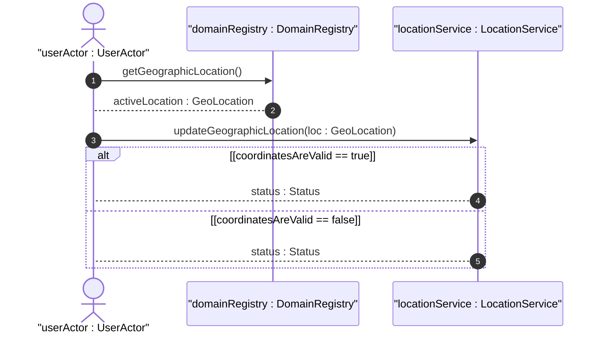

# User Story: Ellipsoidal Positioning on Earth

## Domain Object Mapping
- **Primary Domain Objects:** [ReferenceFrame](file:///Users/perkunas/jail/dep-tst37/docs/features/feat-01-reference-frame.md#L19), [GeodeticSystem](file:///Users/perkunas/jail/dep-tst37/docs/features/feat-01-reference-frame.md#L23), [LocationChoice](file:///Users/perkunas/jail/dep-tst37/docs/features/feat-02-geographic-position.md#L18), [EllipsoidLocation](file:///Users/perkunas/jail/dep-tst37/docs/features/feat-02-geographic-position.md#L21)
- **Actor/Role:** userActor : UserActor (initiator client)

## BDD Scenario (OOA/OOD Realization)
**Given** a Netconf Client session and a configured geodetic-datum of WGS-84
**When** the client sets the position coordinates to latitude 37.774929 and longitude -122.419416
**Then** the system registers the ellipsoidal position and returns a success status

## UML Sequence Diagram

## Operational Context
> "The frame of reference ('reference-frame') defines what the location values refer to and their meaning. The referred-to object can be any astronomical body. The default 'astronomical-body' value is 'earth'." (from [feat-01-reference-frame.md](file:///Users/perkunas/jail/dep-tst37/docs/features/feat-01-reference-frame.md))

> "This is the location on, or relative to, the astronomical object. It is specified using two or three coordinate values. These values are given either as 'latitude', 'longitude', and an optional 'height', or as Cartesian coordinates of 'x', 'y', and 'z'." (from [feat-02-geographic-position.md](file:///Users/perkunas/jail/dep-tst37/docs/features/feat-02-geographic-position.md))

## Required Features Matrix
- [ ] #1 - [Reference Frame Configuration](https://github.com/gintatkinson/dep-tst37/blob/main/docs/features/feat-01-reference-frame.md) ([feat-01-reference-frame.md](file:///Users/perkunas/jail/dep-tst37/docs/features/feat-01-reference-frame.md)) (Provides frame of reference context)
- [ ] #2 - [Geographic Position Resolution](https://github.com/gintatkinson/dep-tst37/blob/main/docs/features/feat-02-geographic-position.md) ([feat-02-geographic-position.md](file:///Users/perkunas/jail/dep-tst37/docs/features/feat-02-geographic-position.md)) (Resolves latitude and longitude coordinates)

## Source References
Structural Schema: [ietf-geo-location@2022-02-11.yang](file:///Users/perkunas/jail/dep-tst37/schema/ietf-geo-location@2022-02-11.yang)
Normative Specification: [RFC 9179](https://datatracker.ietf.org/doc/rfc9179/)
