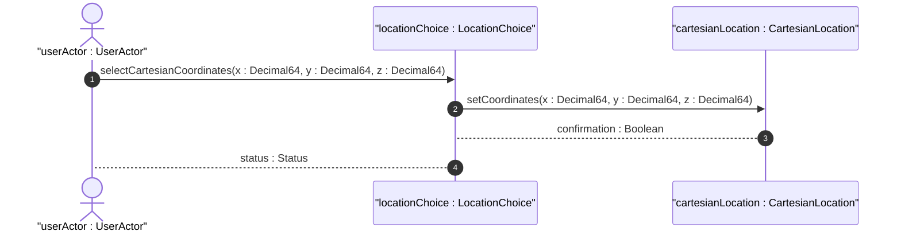

# User Story: Cartesian Coordinate Positioning

## Domain Object Mapping
- **Primary Domain Objects:** [LocationChoice](file:///Users/perkunas/jail/dep-tst37/docs/features/feat-02-geographic-position.md#L18), [CartesianLocation](file:///Users/perkunas/jail/dep-tst37/docs/features/feat-02-geographic-position.md#L26)
- **Actor/Role:** `userActor : UserActor`

## BDD Scenario (OOA/OOD Realization)
**Given** a Netconf Client session
**When** the client sets the position coordinates to Cartesian x, y, and z values in meters
**Then** the system registers the Cartesian position and returns a success status

## UML Sequence Diagram

## Operational Context
> "This is the location on, or relative to, the astronomical object. It is specified using two or three coordinate values. These values are given either as 'latitude', 'longitude', and an optional 'height', or as Cartesian coordinates of 'x', 'y', and 'z'." (from [feat-02-geographic-position.md](file:///Users/perkunas/jail/dep-tst37/docs/features/feat-02-geographic-position.md))

## Required Features Matrix
- [ ] #2 - [Geographic Position Resolution](https://github.com/gintatkinson/dep-tst37/blob/main/docs/features/feat-02-geographic-position.md) ([feat-02-geographic-position.md](file:///Users/perkunas/jail/dep-tst37/docs/features/feat-02-geographic-position.md)) (Provides x, y, z coordinate fields)

## Source References
Structural Schema: [ietf-geo-location@2022-02-11.yang](file:///Users/perkunas/jail/dep-tst37/schema/ietf-geo-location@2022-02-11.yang)
Normative Specification: [RFC 9179](https://datatracker.ietf.org/doc/rfc9179/)
