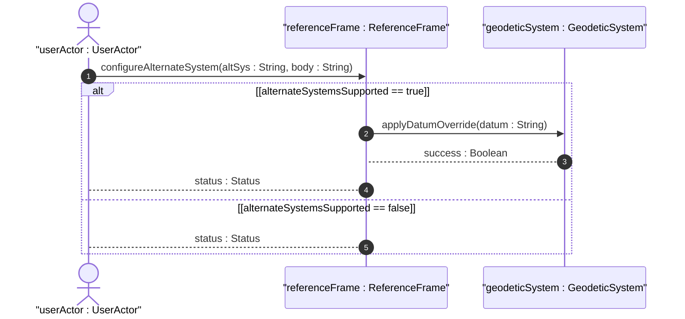
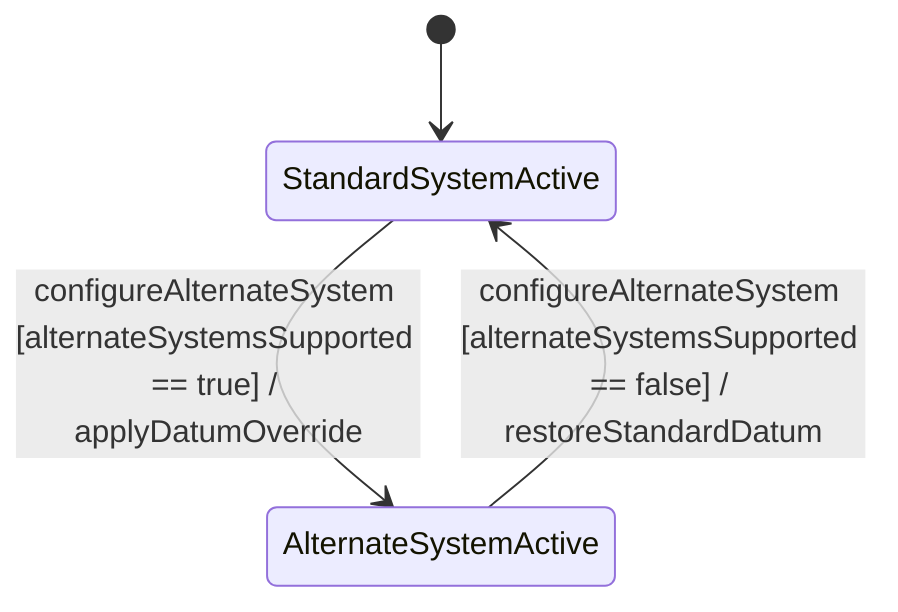

# User Story: Alternate Reference System Simulation

## Domain Object Mapping
- **Primary Domain Objects:** `ReferenceFrame`, `GeodeticSystem`
- **Actor/Role:** `userActor : UserActor`

## BDD Scenario (OOA/OOD Realization)
**Given** a Netconf Client session and the device supports the alternate-systems feature
**When** the client configures alternate-system to "virtual-reality-frame" and astronomical-body to "mars"
**Then** the system applies the alternate reference frame and updates coordinates according to the simulation datum

## UML Sequence Diagram

## UML State Machine Diagram

## Operational Context
"The system in which the astronomical body and geodetic-datum is defined.  Normally, this value is not present and the system is the natural universe; however, when present, this value allows for specifying alternate systems (e.g., virtual realities).  An alternate-system modifies the definition (but not the type) of the other values in the reference frame."

## Required Features Matrix
- [ ] #1 - [Reference Frame Configuration](https://github.com/gintatkinson/dep-tst37/blob/main/docs/features/feat-01-reference-frame.md) (Defines alternate-system and astronomical-body attributes)

## Source References
Structural Schema: [ietf-geo-location@2022-02-11.yang](file:///Users/perkunas/jail/dep-tst37/schema/ietf-geo-location@2022-02-11.yang)
Normative Specification: [RFC 9179](https://datatracker.ietf.org/doc/rfc9179/)
