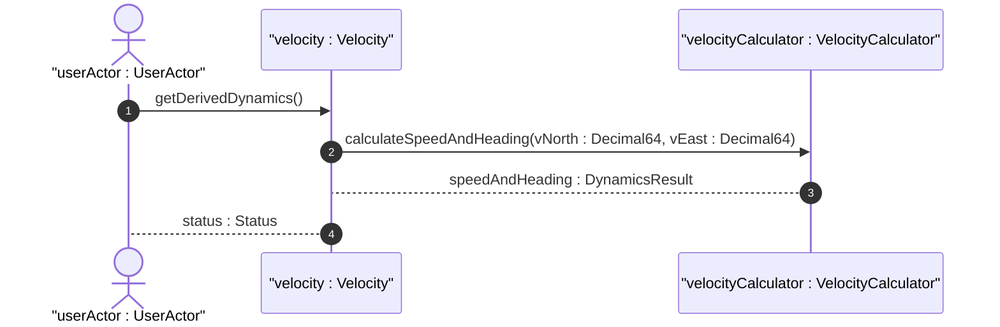

# User Story: Velocity Vector to Speed and Heading Calculation

## Domain Object Mapping
- **Primary Domain Objects:** `Velocity`
- **Actor/Role:** `userActor : UserActor`

## BDD Scenario (OOA/OOD Realization)
**Given** a moving entity with velocity vectors v-north and v-east
**When** the client queries the current derived speed and heading
**Then** the system calculates and returns the values based on:
  speed = sqrt(v_north^2 + v_east^2)
  heading = arctan(v_east / v_north)

## UML Sequence Diagram

## Operational Context
Verbatim from RFC 9179, Section 2.3 (Motion):
> To derive the two-dimensional heading and speed, one would use the following formulas:
> 
>               ,------------------------------
>     speed =  V  v_{north}^{2} + v_{east}^{2}
> 
>     heading = arctan(v_{east} / v_{north})

## Required Features Matrix
- [ ] #3 - [Geolocation Dynamics and Temporal Context](https://github.com/gintatkinson/dep-tst37/blob/main/docs/features/feat-03-dynamics-temporal.md) (Provides v-north and v-east velocity coordinates)

## Source References
Structural Schema: [ietf-geo-location@2022-02-11.yang](file:///Users/perkunas/jail/dep-tst37/schema/ietf-geo-location@2022-02-11.yang)
Normative Specification: [RFC 9179](https://datatracker.ietf.org/doc/rfc9179/)
