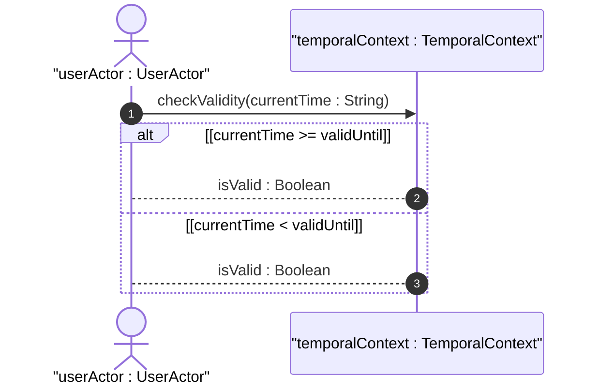
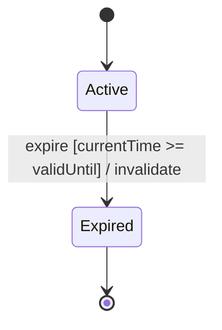

# User Story: Geolocation Temporal Expiration

## Domain Object Mapping
- **Primary Domain Objects:** `TemporalContext`
- **Actor/Role:** `userActor : UserActor`

## BDD Scenario (OOA/OOD Realization)
**Given** a location measurement with valid-until timestamp set
**When** the current time exceeds the valid-until timestamp
**Then** the system transitions the location state to Expired and returns a validation exception on coordinate queries

## UML Sequence Diagram

## UML State Machine Diagram

## Operational Context
Verbatim quote from the `schema/ietf-geo-location@2022-02-11.yang` schema:
> The timestamp for which this geo-location is valid until. If unspecified, the geo-location has no specific expiration time.

## Required Features Matrix
- [x] #3 - [Geolocation Dynamics and Temporal Context](https://github.com/gintatkinson/dep-tst37/blob/main/docs/features/feat-03-dynamics-temporal.md) (Provides valid-until and timestamp fields)

## Source References
Structural Schema: [ietf-geo-location@2022-02-11.yang](file:///Users/perkunas/jail/dep-tst37/schema/ietf-geo-location@2022-02-11.yang)
Normative Specification: [RFC 9179](https://datatracker.ietf.org/doc/rfc9179/)
