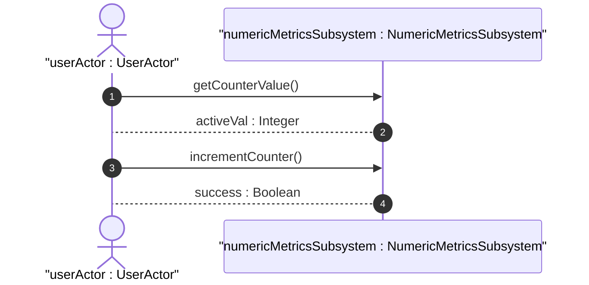

# User Story: Counter and Gauge Operations

## Domain Object Mapping
- **Primary Domain Objects:** `Counter32`, `Gauge32`
- **Actor/Role:** `userActor : UserActor`

## BDD Scenario (OOA/OOD Realization)
**Given** a counter value set to 10
**When** the client calls getCounterValue
**Then** the system returns 10

## UML Sequence Diagram

## Operational Context
> [!NOTE]
> The counter32 type represents a non-negative integer that monotonically increases until it reaches a maximum value of 2^32-1 (4294967295 decimal), when it wraps around and starts increasing again from zero.
>
> Counters have no defined 'initial' value, and thus, a single value of a counter has (in general) no information content. Discontinuities in the monotonically increasing value normally occur at re-initialization of the management system and at other times as specified in the description of a schema node using this type.

## Required Features Matrix
- [ ] #12 - [Numeric and Identifier Metrics](https://github.com/gintatkinson/dep-tst37/blob/base-rfc9179-rfc9911/docs/features/feat-04-numeric-metrics.md) (Provides counters and gauges)

## Source References
Structural Schema: [schema/ietf-yang-types@2025-12-22.yang](file:///Users/perkunas/jail/dep-tst37/schema/ietf-yang-types@2025-12-22.yang)
Normative Specification: [https://datatracker.ietf.org/doc/base-rfc9179-rfc9911/](https://datatracker.ietf.org/doc/base-rfc9179-rfc9911/)
