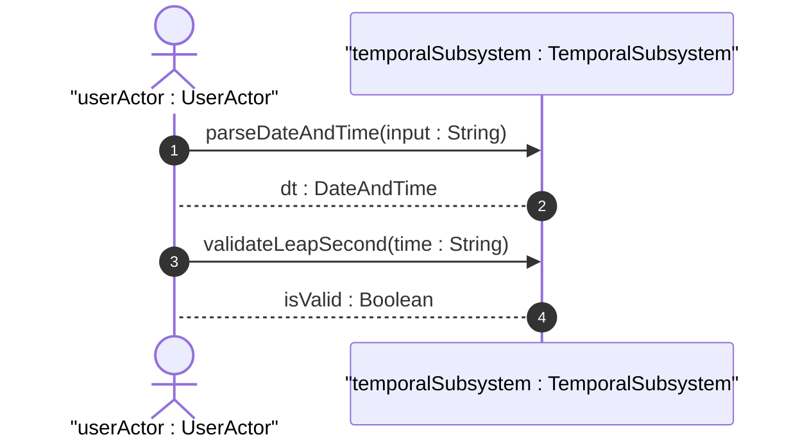

# User Story: Precision Temporal Tracking

## Domain Object Mapping
- **Primary Domain Objects:** [DateAndTime](file:///Users/perkunas/jail/dep-tst37/schema/ietf-yang-types@2025-12-22.yang#L302), [Date](file:///Users/perkunas/jail/dep-tst37/schema/ietf-yang-types@2025-12-22.yang#L357), [Time](file:///Users/perkunas/jail/dep-tst37/schema/ietf-yang-types@2025-12-22.yang#L405)
- **Actor/Role:** [userActor : UserActor](file:///Users/perkunas/jail/dep-tst37/docs/features/feat-05-temporal-precision.md#L18-L19)

## BDD Scenario (OOA/OOD Realization)
**Given** a system time of "2026-06-21T18:00:00Z"
**When** the client parses this datetime
**Then** the system returns the parsed [DateAndTime](file:///Users/perkunas/jail/dep-tst37/schema/ietf-yang-types@2025-12-22.yang#L302) structure

## UML Sequence Diagram

## Operational Context
"The date-and-time type is a profile of the ISO 8601 standard for representation of dates and times using the Gregorian calendar. The profile is defined by the date-time production in Section 5.6 of RFC 3339 and the update defined in Section 2 of RFC 9557. The value of 60 for seconds is allowed only in the case of leap seconds." (from [ietf-yang-types@2025-12-22.yang](file:///Users/perkunas/jail/dep-tst37/schema/ietf-yang-types@2025-12-22.yang#L311-L316))

"The date type represents a time-interval of the length of a day, i.e., 24 hours. It includes an optional time zone offset." (from [ietf-yang-types@2025-12-22.yang](file:///Users/perkunas/jail/dep-tst37/schema/ietf-yang-types@2025-12-22.yang#L362-L365))

"The time type represents an instance of time of zero duration that recurs every day. It includes an optional time zone offset. The value of 60 for seconds is allowed only in the case of leap seconds." (from [ietf-yang-types@2025-12-22.yang](file:///Users/perkunas/jail/dep-tst37/schema/ietf-yang-types@2025-12-22.yang#L412-L416))

## Required Features Matrix
- [ ] #13 - [Date, Time, and Temporal Precision](https://github.com/gintatkinson/dep-tst37/blob/base-rfc9179-rfc9911/docs/features/feat-05-temporal-precision.md) (Provides temporal validation)

## Source References
Structural Schema: [ietf-yang-types@2025-12-22.yang](file:///Users/perkunas/jail/dep-tst37/schema/ietf-yang-types@2025-12-22.yang)
Normative Specification: [RFC 9911](https://datatracker.ietf.org/doc/base-rfc9179-rfc9911/)
