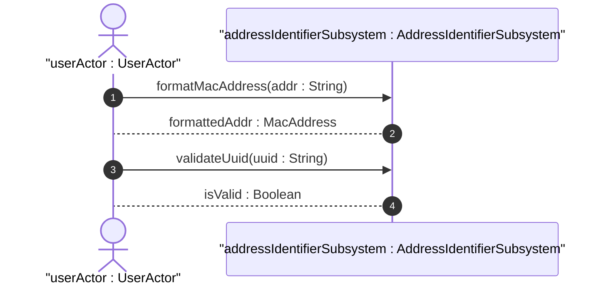

# User Story: Address Parsing

## Domain Object Mapping
- **Primary Domain Objects:** `MacAddress`, `Uuid`
- **Actor/Role:** `userActor : UserActor`

## BDD Scenario (OOA/OOD Realization)
**Given** a MAC address string "001122334455"
**When** the client parses this address
**Then** the system returns the formatted MAC address "00:11:22:33:44:55"

## UML Sequence Diagram


## Operational Context
### `mac-address`
```
The mac-address type represents a 48-bit IEEE 802 Media
Access Control (MAC) address.  The canonical representation
uses lowercase characters.  Note that there are IEEE 802 MAC
addresses with a different length that this type cannot
represent.  The phys-address type may be used to represent
physical addresses of varying length.

In the value set and its semantics, this type is equivalent
to the MacAddress textual convention of the SMIv2.
```

### `uuid`
```
A Universally Unique IDentifier in the string representation
defined in RFC 9562.  The canonical representation uses
lowercase characters.

The following is an example of a UUID in string
representation:
f81d4fae-7dec-11d0-a765-00a0c91e6bf6.
```

## Required Features Matrix
- [ ] #14 - [Physical Addresses and Structural Identifiers](https://github.com/gintatkinson/dep-tst37/blob/base-rfc9179-rfc9911/docs/features/feat-06-physical-structural.md) (Provides MAC address formatting and UUID validation)

## Source References
Structural Schema: [ietf-yang-types@2025-12-22.yang](file:///Users/perkunas/jail/dep-tst37/schema/ietf-yang-types@2025-12-22.yang)
Normative Specification: [RFC 9911](https://datatracker.ietf.org/doc/base-rfc9179-rfc9911/)
