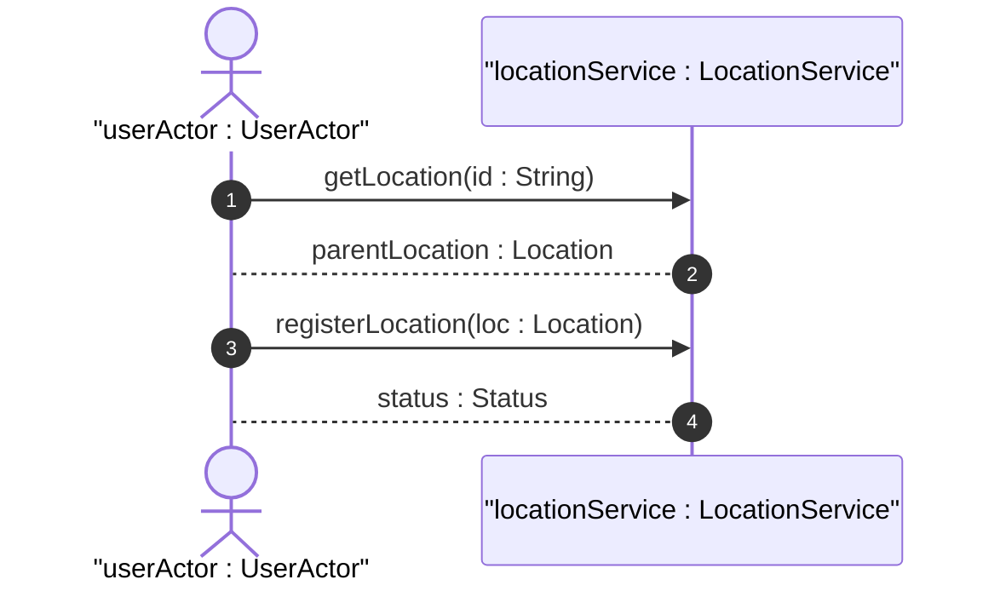

# User Story: Physical Address Validation and Location Hierarchy

## Domain Object Mapping
- **Primary Domain Objects:** [Location](file:///Users/perkunas/jail/dep-tst37/docs/features/feat-07-physical-geographic-location.md#L25), [PhysicalAddress](file:///Users/perkunas/jail/dep-tst37/docs/features/feat-07-physical-geographic-location.md#L32)
- **Actor/Role:** `userActor : UserActor` (initiator client)

## BDD Scenario (OOA/OOD Realization)
**Given** a configured parent location "building-north"
**When** the client registers a child location "equipment-room-101" with parent "building-north" and country-code "US"
**Then** the system validates the ISO country code, links the location to its parent, and returns success status

## UML Sequence Diagram

## Operational Context
> "This feature defines attributes for network inventory locations, including parent-child hierarchy, physical postal addresses, geographic coordinates (datum, accuracy), and record timestamps." (from [feat-07-physical-geographic-location.md](file:///Users/perkunas/jail/dep-tst37/docs/features/feat-07-physical-geographic-location.md))

> "Specifies a country. Expressed as ISO ALPHA-2 code." (from [ietf-ni-location.yang](file:///Users/perkunas/jail/dep-tst37/schema/ietf-ni-location.yang#L147-L148))

> "The identifier of the location that physically contains this location." (from [ietf-ni-location.yang](file:///Users/perkunas/jail/dep-tst37/schema/ietf-ni-location.yang#L185-L187))

## Required Features Matrix
- [ ] #21 - [Physical and Geographic Location Attributes](https://github.com/gintatkinson/dep-tst37/blob/ietf-ni-location/docs/features/feat-07-physical-geographic-location.md) ([feat-07-physical-geographic-location.md](file:///Users/perkunas/jail/dep-tst37/docs/features/feat-07-physical-geographic-location.md)) (Provides address structure and parent hierarchy reference)

## Source References
Structural Schema: [ietf-ni-location.yang](file:///Users/perkunas/jail/dep-tst37/schema/ietf-ni-location.yang)
Normative Specification: [Network Inventory Location](https://datatracker.ietf.org/doc/html/draft-ietf-ivy-network-inventory-location)
