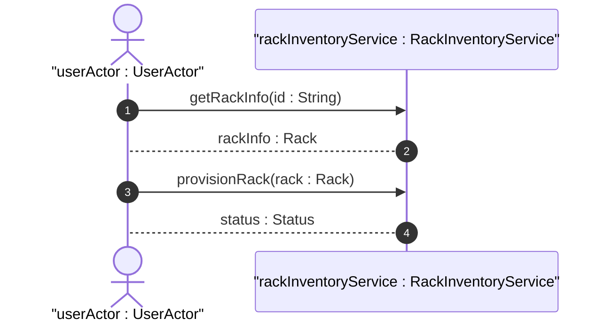

# User Story: Rack Space Allocation and Electrical Limits

## Domain Object Mapping
- **Primary Domain Objects:** [Rack](file:///Users/perkunas/jail/dep-tst37/docs/features/feat-08-rack-infrastructure.md#L25), [RackLocation](file:///Users/perkunas/jail/dep-tst37/docs/features/feat-08-rack-infrastructure.md#L36)
- **Actor/Role:** `userActor : UserActor`

## BDD Scenario (OOA/OOD Realization)
**Given** an equipment room location "equipment-room-101"
**When** the client provisions a rack in row 3, column 4, with standard dimensions and max-allocated-power of 5000 Watts
**Then** the system registers the rack placement and configures the power limits

## UML Sequence Diagram

## Operational Context
> "Top-level container for the list of racks. List of racks within the inventory (e.g., in an equipment room)." (from [feat-08-rack-infrastructure.md](file:///Users/perkunas/jail/dep-tst37/docs/features/feat-08-rack-infrastructure.md))

> "The location information of the rack, which comprises the location reference, row number, and column number." (from [ietf-ni-location.yang](file:///Users/perkunas/jail/dep-tst37/schema/ietf-ni-location.yang))

## Required Features Matrix
- [ ] #22 - [Rack Structural Infrastructure](https://github.com/gintatkinson/dep-tst37/blob/ietf-ni-location/docs/features/feat-08-rack-infrastructure.md) ([feat-08-rack-infrastructure.md](file:///Users/perkunas/jail/dep-tst37/docs/features/feat-08-rack-infrastructure.md)) (Provides dimensions, rack placement, and max power attributes)

## Source References
Structural Schema: [ietf-ni-location.yang](file:///Users/perkunas/jail/dep-tst37/schema/ietf-ni-location.yang)
Normative Specification: [draft-ietf-ivy-network-inventory-location](https://datatracker.ietf.org/doc/html/draft-ietf-ivy-network-inventory-location)
