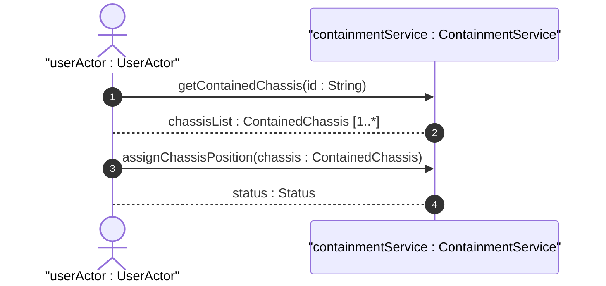

# User Story: Equipment Containment and Relative Positioning

## Domain Object Mapping
- **Primary Domain Objects:** [ContainedChassis](file:///Users/perkunas/jail/dep-tst37/docs/features/feat-09-distributed-chassis-containment.md#L25)
- **Actor/Role:** `userActor : UserActor`

## BDD Scenario (OOA/OOD Realization)
**Given** an active rack and a valid network element reference
**When** the client mounts a chassis component at U-slot position 42
**Then** the system verifies the relative position is unoccupied, validates the leafref constraints, and links the chassis to the rack

## UML Sequence Diagram

## Operational Context
> "The list of chassis within a rack." (from [feat-09-distributed-chassis-containment.md](file:///Users/perkunas/jail/dep-tst37/docs/features/feat-09-distributed-chassis-containment.md))

> "Relative position (e.g., U-slot) of chassis within the rack. Reference to the network element containing the chassis component." (from [ietf-ni-location.yang](file:///Users/perkunas/jail/dep-tst37/schema/ietf-ni-location.yang))

## Required Features Matrix
- [ ] #23 - [Distributed Chassis Layout and Containment](https://github.com/gintatkinson/dep-tst37/blob/ietf-ni-location/docs/features/feat-09-distributed-chassis-containment.md) ([feat-09-distributed-chassis-containment.md](file:///Users/perkunas/jail/dep-tst37/docs/features/feat-09-distributed-chassis-containment.md)) (Provides chassis containment attributes and slot numbers)

## Source References
Structural Schema: [ietf-ni-location.yang](file:///Users/perkunas/jail/dep-tst37/schema/ietf-ni-location.yang)
Normative Specification: [draft-ietf-ivy-network-inventory-location](https://datatracker.ietf.org/doc/html/draft-ietf-ivy-network-inventory-location)
